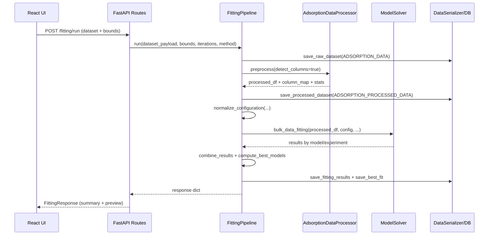

# ADSMOD Architecture

This document describes the architecture of the main ADSMOD application: a local, browser-based adsorption isotherm fitting tool composed of a FastAPI backend and a React/Vite frontend, plus local persistence (SQLite by default).

---

## 1) Repository map (main app)

Top-level:

- `ADSMOD/` — the main application bundle (launcher scripts, frontend, backend, resources)
- `pyproject.toml` — Python backend dependencies and package metadata
- `README.md` — user-facing setup and run instructions
- `legacy/` — separate legacy desktop application to be merged (documented in `REPOSITORY_TO_MERGE.md`)

Within `ADSMOD/`:

- `ADSMOD/server/` — FastAPI backend and fitting pipeline
- `ADSMOD/client/` — React + TypeScript frontend (Vite)
- `ADSMOD/settings/` — runtime configuration (`.env`, `server_configurations.json`)
- `ADSMOD/resources/` — mutable/runtime data: local DB, logs, templates, cached runtimes on Windows
- `ADSMOD/assets/` — static images used in documentation/UI
- `ADSMOD/start_on_windows.bat` — one-click launcher (downloads portable Python/uv/Node, installs deps, runs backend+UI)
- `ADSMOD/setup_and_maintenance.bat` — local maintenance tasks (logs cleanup, uninstall, DB init)

---

## 2) Runtime architecture (what runs where)

### 2.1 Process model

- **Frontend**: Vite dev server or preview server (default UI at `http://127.0.0.1:7861`)
- **Backend**: Uvicorn/FastAPI (default API at `http://127.0.0.1:8000`)

On Windows, `ADSMOD/start_on_windows.bat` orchestrates everything:

- Downloads and uses local, portable runtimes under `ADSMOD/resources/runtimes/`
- Runs `uv sync` against `pyproject.toml` (root) to install backend deps
- Runs `npm install` and `npm run build` (if needed) in `ADSMOD/client`
- Starts Uvicorn with `ADSMOD.server.app:app`
- Starts `vite preview` for the built frontend
- Opens the browser

### 2.2 Network wiring (local only)

The frontend is configured to call the backend through a reverse proxy:

- Frontend base: `http://127.0.0.1:7861`
- Frontend calls `/api/...`
- Vite proxy rewrites `/api` → `http://127.0.0.1:8000/...` (see `ADSMOD/client/vite.config.ts`)

This avoids CORS and keeps the frontend environment simple.

---

## 3) Backend (FastAPI) architecture

### 3.1 Entry point and router composition

Backend entry point: `ADSMOD/server/app.py`

- Creates `FastAPI(...)` from settings (`server_settings.fastapi`)
- Includes 3 routers:
  - `ADSMOD/server/routes/datasets.py`
  - `ADSMOD/server/routes/fitting.py`
  - `ADSMOD/server/routes/browser.py`
- Root endpoint `/` redirects to `/docs`

### 3.2 Layering and responsibilities

The backend is organized into a small service stack:

1. **Routes (API layer)** — `ADSMOD/server/routes/*`
   - request/response handling, validation via Pydantic models
   - error translation to HTTP status codes
2. **Schemas (DTO layer)** — `ADSMOD/server/schemas/*`
   - Pydantic request/response models for the API
3. **Services (domain/application layer)** — `ADSMOD/server/utils/services/*`
   - dataset ingestion and summary (`DatasetService`)
   - preprocessing and column detection (`AdsorptionDataProcessor`)
   - fitting orchestration (`FittingPipeline`) and numerical solving (`ModelSolver`)
   - model definitions (`AdsorptionModels`)
4. **Repository/Serialization (persistence façade)** — `ADSMOD/server/utils/repository/serializer.py`
   - maps Pandas DataFrames to database tables
   - denormalizes/normalizes list-like columns for storage (CSV/JSON-ish encoding)
5. **Database (infrastructure layer)** — `ADSMOD/server/database/*`
   - SQLAlchemy table definitions (`schema.py`)
   - backend selection and delegation (`database.py`)
   - SQLite/PostgreSQL repositories with `save`, `upsert`, `load` (`sqlite.py`, `postgres.py`)
   - initialization script/logic (`initializer.py`, `scripts/initialize_database.py`)

This is effectively a **Service Layer + Repository** architecture: routes call services; services call serializer/repository; repository calls database backend.

### 3.3 Configuration and environment

Configuration sources:

- JSON settings: `ADSMOD/settings/server_configurations.json` (loaded at import time into `server_settings`)
- Optional env overrides: `ADSMOD/settings/.env` loaded by `ADSMOD/server/utils/variables.py`

Settings are expressed as frozen dataclasses:

- `FastAPISettings`, `DatabaseSettings`, `DatasetSettings`, `FittingSettings` (see `ADSMOD/server/utils/configurations/server.py`)

### 3.4 API surface

Endpoints are declared through constants in `ADSMOD/server/utils/constants.py`.

#### Dataset upload

- `POST /datasets/load` (`ADSMOD/server/routes/datasets.py`)
  - Input: multipart form-data with a file field
  - Behavior:
    - reads bytes
    - `DatasetService.read_dataframe(...)` parses CSV or Excel
    - produces a JSON-serializable payload `{columns, records, row_count}`
    - produces a markdown summary (`format_dataset_summary`)
  - Output: `DatasetLoadResponse` with `summary` and `dataset`

#### Run fitting pipeline

- `POST /fitting/run` (`ADSMOD/server/routes/fitting.py`)
  - Input: JSON `FittingRequest` (`ADSMOD/server/schemas/fitting.py`):
    - `dataset` (`DatasetPayload`: columns + records)
    - `parameter_bounds`: per model `{min,max,initial}` maps
    - `max_iterations`
    - `optimization_method` (`LSS`, `BFGS`, `L-BFGS-B`, `Nelder-Mead`, `Powell`)
  - Behavior:
    - executes `FittingPipeline.run(...)` in a background thread via `asyncio.to_thread` (keeps the event loop responsive)
  - Output: `FittingResponse` (plus additional fields returned by backend like `best_model_preview`)

#### Database browser

- `GET /browser/tables` (`ADSMOD/server/routes/browser.py`)
  - Returns a curated list of browsable tables (name + display name)
- `GET /browser/data/{table_name}`
  - Loads the full table into a DataFrame and returns:
    - `columns`, row/column counts, and JSON rows

### 3.5 Fitting pipeline (core domain flow)

The main orchestration is `ADSMOD/server/utils/services/fitting.py::FittingPipeline`.

High-level algorithm:

1. Convert uploaded dataset payload → Pandas DataFrame
2. Persist raw data → `ADSORPTION_DATA`
3. Preprocess:
   - infer canonical column mapping (regex + fuzzy matches)
   - drop invalid rows (NaNs, non-physical values)
   - aggregate by experiment (one row per experiment, pressure/uptake stored as sequences)
   - compute statistics report (markdown)
4. Persist processed experiment dataset → `ADSORPTION_PROCESSED_DATA`
5. Normalize model configuration:
   - aligns UI model keys with backend model names
   - applies per-model defaults (`MODEL_PARAMETER_DEFAULTS`)
   - applies alias mapping for legacy naming compatibility (`PARAMETER_ALIAS_MAP`)
   - fixes invalid bounds by swapping when `max < min`
6. Fit all experiments × all enabled models:
   - `ModelSolver.bulk_data_fitting(...)` loops experiments and calls `single_experiment_fit(...)`
   - Each model fit uses either:
     - `scipy.optimize.curve_fit` for `"LSS"` (bounded least squares), or
     - `scipy.optimize.minimize` for other methods (optionally with bounds)
   - Computes diagnostic metrics:
     - score = sum of squared residuals
     - AIC and AICc via `compute_information_metrics(...)`
7. Combine results back into the experiment DataFrame:
   - Adds per-model columns (`{Model} score`, `{Model} AIC`, `{Model} AICc`, parameter columns, parameter error columns)
8. Persist fitting results:
   - experiment rows → `ADSORPTION_EXPERIMENT`
   - per-model result tables → `ADSORPTION_LANGMUIR`, `ADSORPTION_SIPS`, ...
9. Compute and persist best/worst model per experiment:
   - uses metric configured in `server_settings.fitting.best_model_metric` (default `AICc`)
   - writes `ADSORPTION_BEST_FIT`
10. Return response summary and preview rows for the UI

Mermaid (sequence) view:

### 3.6 Numerical solving strategy (ModelSolver)

`ModelSolver` is responsible for the per-experiment per-model fit.

- Model functions come from `AdsorptionModels` and are fetched by name.
- Parameter ordering is derived from `inspect.signature(model)` (the function signature is the source of truth).
- LSS path:
  - Uses `curve_fit` with bounds and `maxfev = max_iterations`
  - Computes parameter standard errors from covariance diagonal
- General optimization path:
  - Uses `minimize` with an objective = SSE (sum of squared errors)
  - Projects parameters into bounds (clipping) and applies penalties when predictions become non-finite
  - Tries to extract a covariance estimate from the optimizer Hessian inverse when available

### 3.7 Persistence model (SQLAlchemy tables)

`ADSMOD/server/database/schema.py` defines one table per concept:

- `ADSORPTION_DATA` — raw, per-measurement upload rows
- `ADSORPTION_PROCESSED_DATA` — processed per-experiment rows (pressure and uptake stored as strings)
- `ADSORPTION_EXPERIMENT` — canonical per-experiment table used as foreign-key root
- One table per model:
  - `ADSORPTION_LANGMUIR`, `ADSORPTION_SIPS`, `ADSORPTION_FREUNDLICH`, `ADSORPTION_TEMKIN`,
    `ADSORPTION_TOTH`, `ADSORPTION_DUBININ_RADUSHKEVICH`, `ADSORPTION_DUAL_SITE_LANGMUIR`,
    `ADSORPTION_REDLICH_PETERSON`, `ADSORPTION_JOVANOVIC`
- `ADSORPTION_BEST_FIT` — best/worst model names per experiment

How result storage works:

- `DataSerializer.save_fitting_results(...)`:
  - builds an `ADSORPTION_EXPERIMENT` frame with `id = 1..N`
  - builds per-model frames by picking columns from the combined DataFrame using a schema map (`ADSMOD/server/schemas/models.py::MODEL_SCHEMAS`)
  - writes tables via `database.save_into_database(...)`

Database backend selection:

- Default is embedded SQLite under `ADSMOD/resources/database/sqlite.db`
- Can switch to PostgreSQL via configuration (and `.env` overrides) using `DatabaseSettings`

---

## 4) Frontend (React/Vite) architecture

### 4.1 Entry point

- `ADSMOD/client/src/main.tsx` mounts `<App />`
- `ADSMOD/client/src/App.tsx` is the single-page stateful container

There is no react-router; navigation is a local state machine:

- `PageType = 'config' | 'models' | 'browser'`

### 4.2 UI pages and components

Pages (rendered by `App.tsx`):

- **Config**: `ADSMOD/client/src/components/ConfigPage.tsx`
  - dataset upload
  - max iterations and optimization method
  - run fitting and show logs/summary markdown
- **Models**: `ADSMOD/client/src/components/ModelsPage.tsx`
  - grid of model cards
  - enables/disables models and edits parameter bounds
- **Browser**: `ADSMOD/client/src/components/DatabaseBrowserPage.tsx`
  - lists DB tables and shows their contents

Reusable building blocks:

- `ADSMOD/client/src/components/ModelCard.tsx` — collapsed (description + KaTeX equation) vs expanded (configuration form)
- `ADSMOD/client/src/components/ModelConfigForm.tsx` — generates bound inputs from per-model defaults
- `ADSMOD/client/src/components/MarkdownRenderer.tsx` — renders backend markdown summary (ReactMarkdown + GFM)
- `ADSMOD/client/src/components/EquationRenderer.tsx` — KaTeX renderer (dynamic import)
- `ADSMOD/client/src/components/UIComponents.tsx` — basic inputs (NumberInput, FileUpload, Switch, etc.)

### 4.3 Data flow and state ownership

`App.tsx` owns all cross-page state:

- Dataset:
  - `dataset` (payload returned by backend)
  - `datasetName`, `datasetSamples`, `datasetStats` (markdown)
- Fitting:
  - `maxIterations`, `optimizationMethod`, `fittingStatus`
- Model configuration:
  - `modelStates[modelName] = { enabled, config }`
  - defaults come from `ADSMOD/client/src/adsorptionModels.ts`
- Database browser state:
  - stored in `databaseBrowserState` so it persists when switching pages

### 4.4 API client layer

`ADSMOD/client/src/services.ts` contains small functions that call the backend:

- `loadDataset(file)` → `POST /datasets/load` (multipart form-data)
- `startFitting(payload)` → `POST /fitting/run` (JSON)
- `fetchTableList()` → `GET /browser/tables`
- `fetchTableData(tableName)` → `GET /browser/data/{table_name}`

Error handling pattern:

- backend errors are expected in the `detail` field (FastAPI convention)
- services translate them into user-visible strings like `[ERROR] ...`

### 4.5 Model metadata and parameter defaults

Frontend model metadata: `ADSMOD/client/src/adsorptionModels.ts`

- Contains:
  - display name + ID
  - short description
  - LaTeX equation
  - `parameterDefaults` (min/max ranges)

Backend defaults mirror these in `ADSMOD/server/utils/constants.py::MODEL_PARAMETER_DEFAULTS`.

---

## 5) Cross-cutting concerns

### 5.1 Logging

Backend logging is configured in `ADSMOD/server/utils/logger.py`:

- Logs to console (INFO) and to a timestamped file under `ADSMOD/resources/logs/`

### 5.2 Error handling and validation

- Route layer catches `ValueError` and converts to HTTP 400
- Other exceptions are HTTP 500 with a generic message (and stack traces in logs)
- Pydantic validates JSON payloads for `/fitting/run` (types and method enum)

### 5.3 “Patterns” present in the codebase

- **Service Layer**: `DatasetService`, `FittingPipeline`, `AdsorptionDataProcessor`
- **Repository façade**: `DataSerializer` (application-specific persistence mapping)
- **Factory**: database backend factory (`build_sqlite_backend`, `build_postgres_backend`)
- **Strategy (implicit)**: optimization method selection (`LSS` vs `minimize` methods)
- **Configuration object**: `server_settings` loaded once and referenced throughout

---

## 6) How to extend ADSMOD safely

### 6.1 Add a new adsorption model (backend + frontend)

Backend changes (conceptually):

1. Add the model name to `ADSMOD/server/utils/constants.py::MODELS_LIST` and `FITTING_MODEL_NAMES`
2. Add parameter bounds to `MODEL_PARAMETER_DEFAULTS`
3. Implement the model in `ADSMOD/server/utils/services/models.py::AdsorptionModels`
4. Add a SQLAlchemy table in `ADSMOD/server/database/schema.py`
5. Add an entry in `ADSMOD/server/schemas/models.py::MODEL_SCHEMAS` matching the table columns
6. Ensure browser mapping includes the new table in `BROWSER_TABLE_DISPLAY_NAMES`

Frontend changes (conceptually):

1. Add model metadata + equation in `ADSMOD/client/src/adsorptionModels.ts`
2. Add `parameterDefaults` that match the backend parameter names (or ensure aliasing exists server-side)

### 6.2 Add a new API endpoint

Pattern to follow:

- Define endpoint constants in `ADSMOD/server/utils/constants.py`
- Create a router module under `ADSMOD/server/routes/`
- Add Pydantic schemas under `ADSMOD/server/schemas/`
- Add/extend service logic under `ADSMOD/server/utils/services/`
- Mount the router in `ADSMOD/server/app.py`

---

## 7) Known “special” directories

- `ADSMOD/resources/runtimes/` — Windows launcher-managed portable runtimes and caches
- `ADSMOD/ADSORFIT/` — a bundled/archived copy of frontend assets and scripts (currently separate from the main `ADSMOD/client` flow)

