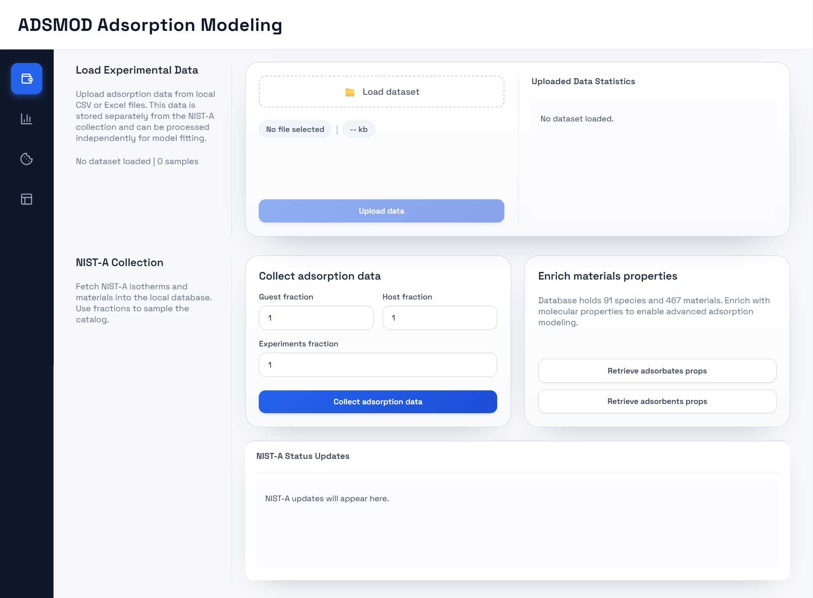
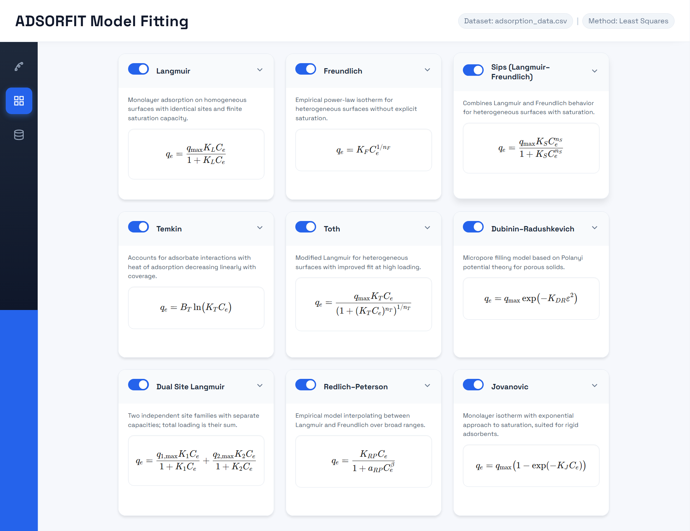
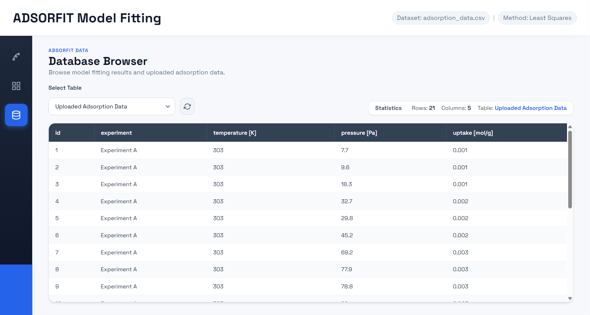

# ADSMOD: Automated Adsorption Model Fitting

## 1. Project Overview
ADSMOD is a local, browser-based application for fitting adsorption isotherm models to experimental datasets and comparing results in a single workflow.

- **Backend (FastAPI):** ingests datasets, runs the fitting process, and exposes an API for the UI; results and experiment metadata are persisted locally.
- **Frontend (React + TypeScript):** provides an interactive interface to upload data, configure fitting options, run fits, and review/compare outputs.

Core workflow: import data → configure active models and parameter bounds → run fitting → inspect and compare fitted curves/metrics → keep results for later review.

## 2. Installation

### 2.1 Windows (One Click Setup)
The Windows setup is automated and portable. Run `ADSMOD/start_on_windows.bat`; the launcher performs the following actions:

1. Download and extract an embeddable Python 3.12 runtime into `ADSMOD/resources/runtimes/python`
2. Download and extract a portable `uv` binary into `ADSMOD/resources/runtimes/uv`
3. Download and extract a portable Node.js runtime into `ADSMOD/resources/runtimes/nodejs`
4. Install backend dependencies from `pyproject.toml` using `uv sync`
5. Install frontend dependencies (if needed) in `ADSMOD/client`
6. Build the frontend (if needed) in `ADSMOD/client`
7. Start backend and frontend and open the UI in your default browser

**First run behavior:** downloads runtimes and installs dependencies, so it can take a few minutes.

**Subsequent run behavior:** reuses the cached runtimes and previously built assets, so startup is typically quick.

> **Portability / system side effects:** the launcher keeps runtimes and caches under `ADSMOD/resources/runtimes/` and avoids system-wide installs. Deleting `ADSMOD/resources/runtimes/` forces a clean setup on the next run.

### 2.2 macOS / Linux (Manual Setup)

**Prerequisites**
- Python 3.12
- Node.js + npm
- Optional: `uv` (recommended) or a recent `pip`

**Setup steps**
1. Backend: create and activate a Python 3.12 environment.
2. Backend: from the repository root, install dependencies: `pip install -e . --use-pep517` (or `uv pip install -e .`).
3. (Optional) Backend: install development extras: `pip install -e .[dev]`.
4. Frontend: from `ADSMOD/client`, install dependencies: `npm install`.

## 3. How to use

### 3.1 Windows
Launch `ADSMOD/start_on_windows.bat`.

The UI becomes available at `http://127.0.0.1:7861`.

### 3.2 macOS / Linux
Start backend and frontend in separate terminals:

```bash
uvicorn ADSMOD.server.app:app --host 127.0.0.1 --port 8000
```

```bash
cd ADSMOD/client
npm run dev -- --host 127.0.0.1 --port 7861
```

Local URLs:
- UI: `http://127.0.0.1:7861`
- Backend API: `http://127.0.0.1:8000`
- API docs: `http://127.0.0.1:8000/docs`

### 3.3 Using the Application
Typical workflow:
1. Import data on the **Dataset** page.
2. Enable/configure isotherm models on the **Models** page.
3. Run and compare fits on the **Fitting** page (iterate as needed).

#### Dataset Page
Upload adsorption data from CSV/Excel, inspect the parsed table, and sanity-check basic summaries before fitting.
Run the optimization and keep the best results for later review; tweak model selection/bounds and re-run to improve fit quality.



#### Models Page
Select which models to include in the run and define parameter bounds/limits to keep optimization physically meaningful.



#### Database browser
Explore the database to fetch data such as uploaded adsorption data, fitting results and best model fittings.



## 4. Setup and Maintenance
Use `ADSMOD/setup_and_maintenance.bat` for common maintenance tasks:

- **Remove logs:** deletes `*.log` files under `ADSMOD/resources/logs`.
- **Uninstall app:** removes local runtimes/caches and build artifacts (for a clean setup on next launch).
- **Initialize database:** runs the backend initialization routine using the bundled Windows runtimes (run `ADSMOD/start_on_windows.bat` at least once first).

## 5. Resources
`ADSMOD/resources` contains local runtime assets, templates, logs, and persistent data used by ADSMOD.

- database: local database files used to persist uploaded experiments and fitting results.
- logs: launcher/backend logs used for troubleshooting.
- runtimes: portable runtimes and caches used by the Windows launcher.
- templates: starter files such as `ADSMOD/resources/templates/adsorption_data.csv` and `ADSMOD/resources/templates/.env`.

## 6. Configuration
Configuration files are stored alongside the app so the project can be run and moved without a system-wide install.

- **Backend / launcher configuration:** `ADSMOD/settings/.env` (start from `ADSMOD/resources/templates/.env`). These values control backend bind settings and launcher options.
- **Frontend configuration:** `ADSMOD/client/.env`. These values control `VITE_` build-time variables used by the React app.

| Variable | Description |
|----------|-------------|
| `FASTAPI_HOST` | Backend bind host. Defined in `ADSMOD/settings/.env`. Default: `127.0.0.1`. |
| `FASTAPI_PORT` | Backend bind port. Defined in `ADSMOD/settings/.env`. Default: `8000`. |
| `RELOAD` | Enable backend auto-reload when using the Windows launcher. Defined in `ADSMOD/settings/.env`. Default: `false`. |
| `UI_HOST` | UI bind host used by the Windows launcher. Defined in `ADSMOD/settings/.env` (optional). Default: `127.0.0.1`. |
| `UI_PORT` | UI bind port used by the Windows launcher. Defined in `ADSMOD/settings/.env` (optional). Default: `7861`. |
| `VITE_API_BASE_URL` | Frontend API base path/URL. Defined in `ADSMOD/client/.env`. Default: `/api`. |


## 7. License
This project is licensed under the MIT license. See `LICENSE` for details.
