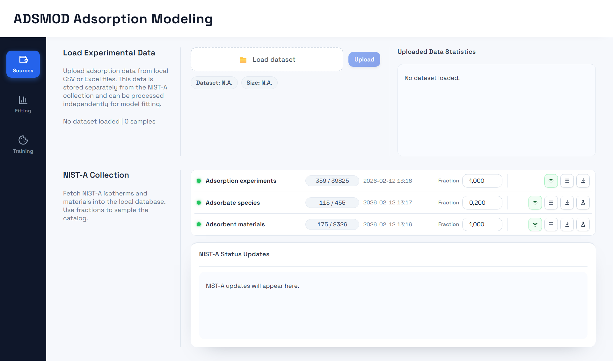
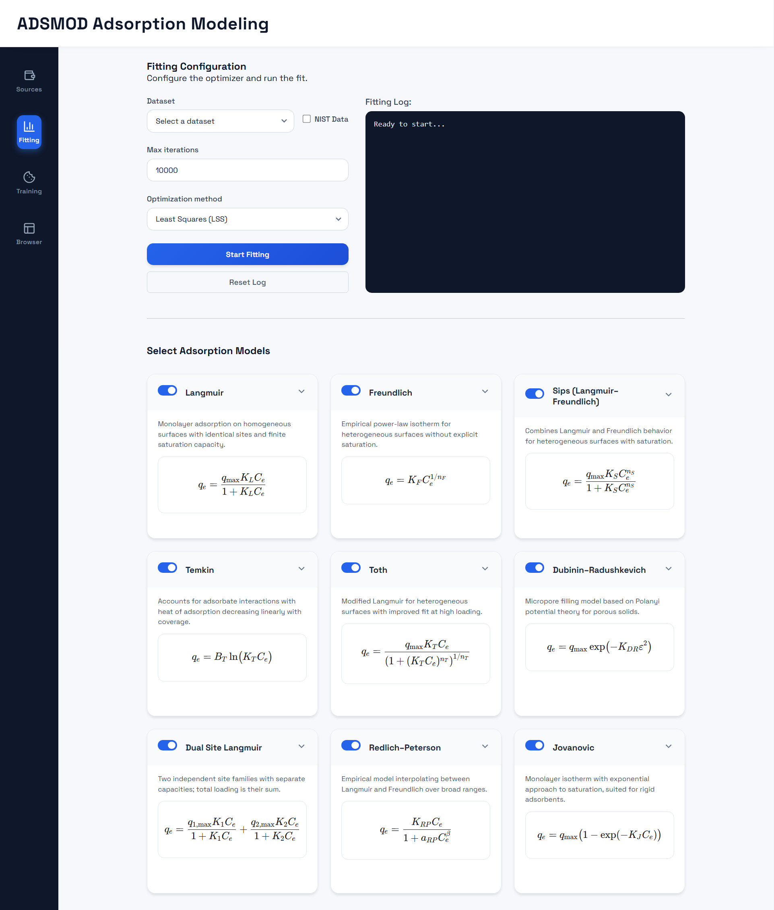
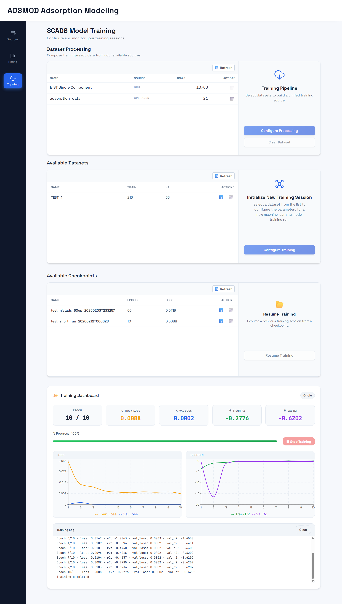

# ADSMOD Adsorption Modeling

## 1. Project Overview

ADSMOD is a comprehensive web application designed for the collection, management, and modeling of adsorption data. This project represents the evolution and unification of two predecessor projects: **ADSORFIT** and **NISTADS Adsorption Modeling** (the former name of this repository).

By merging the capabilities of these systems into a single, cohesive platform, ADSMOD provides a robust workflow for researchers and material scientists. The application allows users to:
- **Collect** adsorption isotherms from the NIST Adsorption Database.
- **Enrich** material data with chemical properties fetched from PubChem.
- **Build** curated, standardized datasets suitable for machine learning.
- **Train and Evaluate** deep learning models to predict adsorption behaviors.

The system is organized as a modern web application, featuring a responsive user interface that interacts with a powerful backend for data processing and machine learning tasks. It is designed to abstract away the complexity of raw data handling, allowing users to focus on scientific analysis and model development.

> **Work in Progress**: This project is still under active development. It will be updated regularly, but you may encounter bugs, issues, or incomplete features.


## 2. Model and Dataset

This project utilizes deep learning techniques to model adsorption phenomena.

- **Model**: The core of the learning capabilities is the **SCADS** model architecture. It is designed to learn from complex, sequence-based adsorption data.
- **Learning**: The system relies on **Supervised Learning**, using historical experimental data to train models that can predict adsorption uptake under various conditions.
- **Dataset**:
    - **Primary Source**: Experimental adsorption isotherms are sourced directly from the **NIST Adsorption Database**.
    - **Enrichment**: Chemical properties (e.g., molecular weights, SMILES strings) are sourced from **PubChem**.
    - The application automatically handles the fetching, cleaning, and merging of these distinct data sources to create training-ready datasets.


## 3. Installation

### 3.1 Windows (One Click Setup)

ADSMOD provides an automated installation and launcher script for Windows users, streamlining the setup process.

1.  Navigate to the `ADSMOD` directory.
2.  Locate and run the `start_on_windows.bat` script.

**What this script does:**
- It downloads portable Python, uv, and Node.js runtimes in `ADSMOD/resources/runtimes` (first run only).
- It installs backend dependencies from `pyproject.toml` using `uv`.
- It installs frontend dependencies and builds the frontend bundle.
- It starts backend and frontend automatically.

**First Run vs. Subsequent Runs:**
- On the **first run**, the script may take some time to download and install all dependencies.
- On **subsequent runs**, it will skip installation and immediately launch the application.

### 3.2 Cloud (Docker)

Cloud deployment uses Dockerized backend + frontend:

```cmd
copy /Y ADSMOD\settings\.env.cloud.example ADSMOD\settings\.env
docker compose --env-file ADSMOD/settings/.env build --no-cache
docker compose --env-file ADSMOD/settings/.env up -d
```

Stop cloud containers:

```cmd
docker compose --env-file ADSMOD/settings/.env down
```

### 3.3 Manual Setup (Advanced)

If you prefer to set up the application manually or are running on a non-Windows environment, ensure you have Python and Node.js installed. You will need to install the backend dependencies from `pyproject.toml` and the frontend dependencies from the `client` directory, then launch the server and client components respectively.


## 4. How to Use

### 4.1 Launching the Application

**Windows:**
Simply double-click `start_on_windows.bat` in the `ADSMOD` folder. This opens backend/frontend logs and launches the UI at `http://<UI_HOST>:<UI_PORT>` from `ADSMOD/settings/.env`.

**Cloud:**
After `docker compose up -d`, open `http://<UI_HOST>:<UI_PORT>` using values in `ADSMOD/settings/.env` (for the provided cloud profile, `http://0.0.0.0:8080`).

### 4.2 Mode Switching

Mode switching is configuration-only:

```cmd
copy /Y ADSMOD\settings\.env.local.example ADSMOD\settings\.env
```

or

```cmd
copy /Y ADSMOD\settings\.env.cloud.example ADSMOD\settings\.env
```

No source code changes are required.

### 4.3 Operational Workflow

The application workflow is divided into four main sections, accessible via the navigation sidebar:

#### 4.3.1 Data Source Configuration

This section serves as the entry point for managing experimental data. It allows users to either upload their own datasets or fetch data directly from the NIST Adsorption Database.
- **Load Experimental Data**: Upload local `.csv` or `.xlsx` files containing adsorption data for independent processing.
- **NIST-A Collection**: Automatically fetch isotherms and material metadata from the NIST database.
- **Status Monitoring**: Track the progress of data fetching and enrichment tasks in real-time with granular progress bars.



#### 4.3.2 Models & Fitting

Before training deep learning models, users can analyze individual isotherms using classical theoretical models.
- **Fitting Configuration**: Select a target dataset (either uploaded or from NIST) and configure the optimizer (e.g., LSS, BFGS) and maximum iterations.
- **Model Selection**: Choose from 9 available adsorption models (including Langmuir, Freundlich, Sips) to fit to the experimental data.
- **Execution & Logging**: Run the fitting process and view detailed execution logs to monitor convergence and errors.



#### 4.3.3 Model Training (Analysis)

This is the core interface for the deep learning pipeline, enabling users to build datasets, train models, and resume experiments.

**Dataset Building**
- **Pipeline Execution**: Transform collected isotherms into training-ready datasets.
- **Progress Tracking**: Monitor the build process with real-time status updates and progress bars.
- **Metadata Inspection**: View detailed statistics and properties of processed datasets before training.

**New Training Wizard**
A step-by-step guided workflow for configuring training experiments:
1. **Dataset Configuration**: Set sampling rates, validation splits, and shuffling parameters.
2. **Model Configuration**: Customize the SCADS architecture (encoders, attention heads, embedding dimensions).
3. **Training Configuration**: Define epochs, batch size, learning rate schedules, and GPU usage.
4. **Review & Launch**: Name the experiment and verify settings before starting.

**Resume Training**
- **Checkpoint Selection**: Browse saved checkpoints from previous runs.
- **Seamless Continuation**: Resume optimization exactly where it left off, with the option to adjust learning parameters.




## 5. Setup and Maintenance
Run `ADSMOD/setup_and_maintenance.bat` to access setup and maintenance actions:

- **Remove logs** - clear `.log` files under `ADSMOD/resources/logs`.
- **Uninstall app** - remove local runtimes and build artifacts (uv, embedded Python, portable Node.js, `node_modules`, `dist`, `.venv`, `uv.lock`) while preserving folder scaffolding.
- **Initialize database** - create or reset the project database schema.


## 6. Resources

The application stores data and artifacts in specific directories, primarily under `ADSMOD/resources`.

- **checkpoints**: Stores trained model weights, training history, and model configuration files.
- **database**: Contains the local SQLite database storing metadata, cached API responses, and experiment indexes.
- **logs**: Application logs for debugging and monitoring background processes.
- **runtimes:** portable Python/uv/Node.js downloaded by the Windows launcher.
- **templates:** starter assets such as the `.env` scaffold


## 7. Configuration
Non-runtime backend defaults are defined in `ADSMOD/settings/configurations.json` (`datasets`, `nist`, `fitting`, `jobs`, `training`).

Runtime values are loaded from `ADSMOD/settings/.env` and apply to:
- backend bind host/port (`FASTAPI_HOST`, `FASTAPI_PORT`)
- frontend host/port (`UI_HOST`, `UI_PORT`)
- API base path (`VITE_API_BASE_URL`)
- database runtime mode (`DB_EMBEDDED`) and external DB connection fields

Use these profile files as templates:
- `ADSMOD/settings/.env.local.example`
- `ADSMOD/settings/.env.cloud.example`

For packaging and runtime details, see `docs/PACKAGING_AND_RUNTIME_MODES.md`.

## 8. License

This project is licensed under the **MIT License**. See `LICENSE` for full terms.
