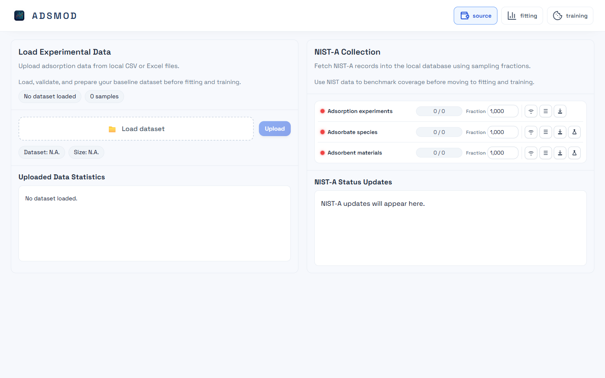
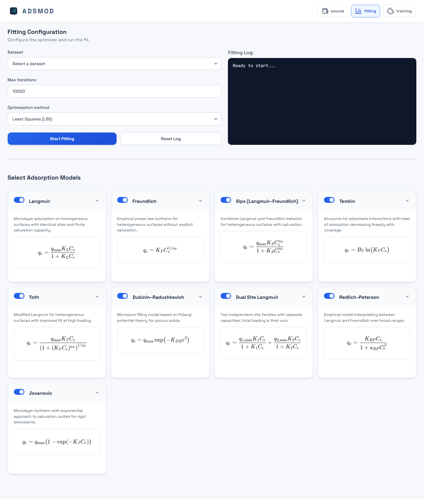
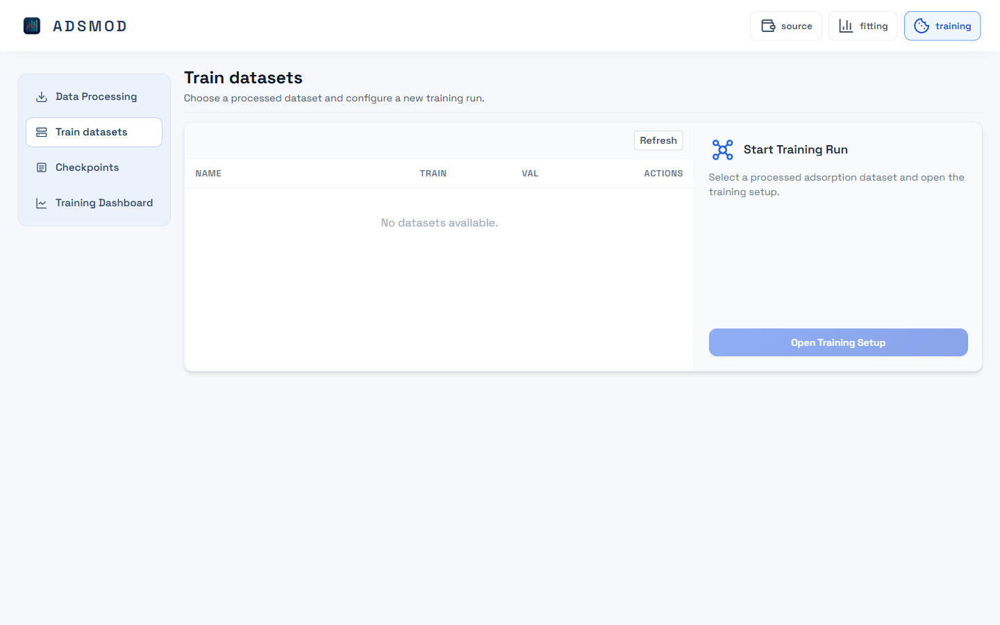
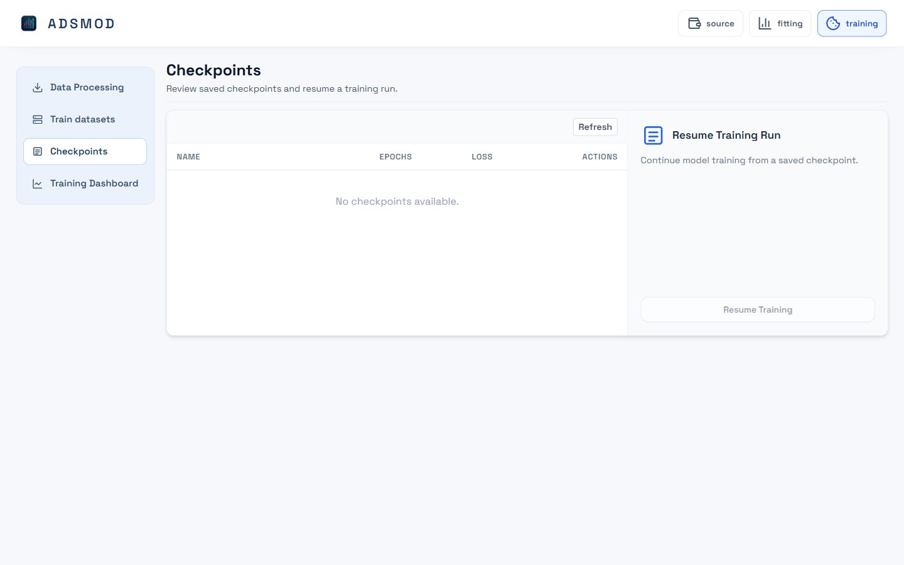
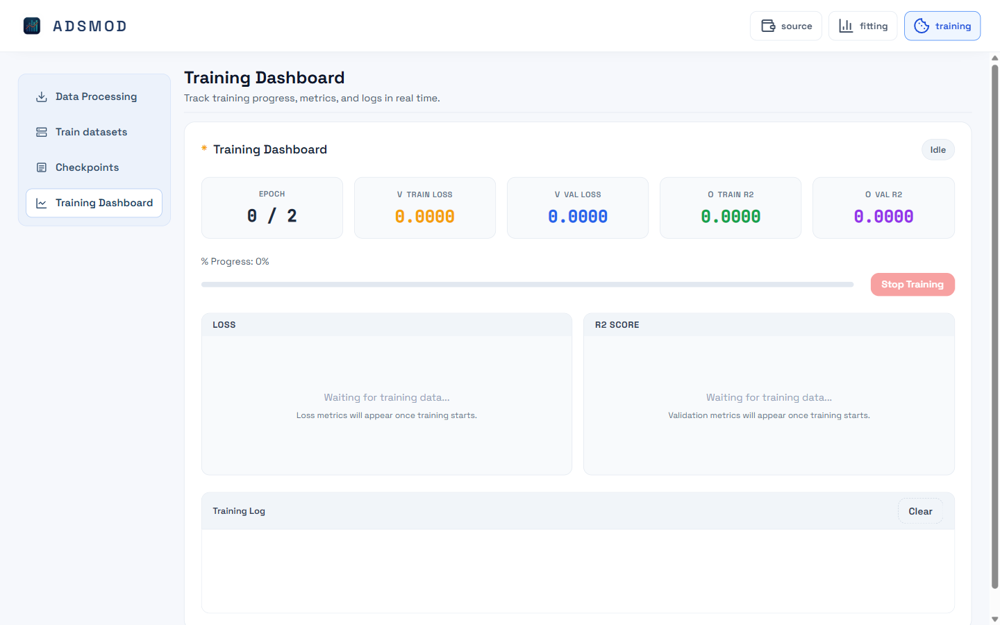

# ADSMOD Adsorption Modeling
[](https://github.com/CTCycle/ADSMOD-Adsorption-Modeling/releases)
[](https://www.python.org/)
[](https://nodejs.org/)
[](LICENSE)
[](https://github.com/CTCycle/ADSMOD-Adsorption-Modeling/actions/workflows/ci.yml)

## 1. Project Overview

ADSMOD is a comprehensive web application designed for the collection, management, and modeling of adsorption data. This project represents the evolution and unification of two predecessor projects: **ADSORFIT** and **NISTADS Adsorption Modeling** (the former name of this repository).

### Service and frontend split

- Backend split:
- `app/server/core_service` (non-ML API workflows)
- `app/server/ml_service` (training/ML workflows)
- `app/server/shared` (shared persistence and repository layer)
- Frontend split:
- `app/client` (Angular core UI for source/fitting; talks only to `core_service`)
- `app/ml_client` (Angular ML UI for training; talks only to `ml_service`)

By merging the capabilities of these systems into a single, cohesive platform, ADSMOD provides a robust workflow for researchers and material scientists. The application allows users to:
- **Collect** adsorption isotherms from the NIST Adsorption Database.
- **Enrich** material data with chemical properties fetched from PubChem.
- **Build** curated, standardized datasets suitable for machine learning.
- **Train and Evaluate** deep learning models to predict adsorption behaviors.

The system is organized as a modern web application with a responsive user interface and a backend focused on data processing and machine learning tasks.

> **Work in Progress**: This project is still under active development. It will be updated regularly, but you may encounter bugs, issues, or incomplete features.

## 2. Model and Dataset

This project utilizes deep learning techniques to model adsorption phenomena.

- **Model**: The core learning capability is based on the **SCADS** model architecture.
- **Learning**: The system relies on **Supervised Learning**, using historical experimental data to train predictive models.
- **Dataset**:
  - **Primary Source**: Experimental adsorption isotherms from the **NIST Adsorption Database**.
  - **Enrichment**: Chemical properties (for example molecular weights and SMILES strings) from **PubChem**.
  - The application handles fetch, cleanup, and merge steps to produce training-ready datasets.

## 3. Installation

### 3.1 Windows (One Click Setup)

ADSMOD provides an automated menu-driven launcher and maintenance script for Windows users.

1. Navigate to the `ADSMOD` directory.
2. Run `start_on_windows.bat`.

**What this script does:**
- Downloads portable Python, uv, and Node.js runtimes into `runtimes/` (first run only).
- Installs backend dependencies from `pyproject.toml` into `app/server/.venv`.
- Installs frontend dependencies and can build the selected frontend bundle.
- Exposes launch modes for the core webapp, ML webapp, or both.
- Exposes setup and maintenance actions for core-only, ML-only, or shared operations.

**First Run vs. Subsequent Runs:**
- On the **first run**, setup may take time because runtimes and dependencies are downloaded.
- On **subsequent runs**, launch is faster because setup is reused.

### 3.2 Manual Setup (Advanced)

If you prefer manual setup or are running outside the launcher workflow:
1. Install Python and Node.js.
2. Run `uv sync --all-packages --group dev` from `app/server`.
3. Install frontend dependencies in `app/client` and `app/ml_client`.
4. Launch backend and frontend processes.

### Backend startup commands (Stage 1)

```cmd
app\server\.venv\Scripts\python.exe -m uvicorn app.server.app:app --host 127.0.0.1 --port 6045
app\server\.venv\Scripts\python.exe -m uvicorn core_service.app:app --host 127.0.0.1 --port 8000
app\server\.venv\Scripts\python.exe -m uvicorn ml_service.app:app --host 127.0.0.1 --port 8001
cd app\client && npm run dev
cd app\ml_client && npm run dev
```

## 4. How to Use

### 4.1 Launching the Application

**Windows:**
Double-click `start_on_windows.bat`. Use the menu to launch the core webapp, the ML webapp, or both.

**Windows (Packaged Tauri App):**
Build with `release\tauri\build_with_tauri.bat`, then launch from `release/windows/installers` or `release/windows/portable`.

### 4.2 Mode Switching

Both local web mode and packaged Tauri mode use the same runtime file:

- `settings/.env`

Adjust host/port and runtime backend values in that file when needed.

### 4.3 Operational Workflow and UI Snapshots

The application workflow is split across two frontends:
- Core frontend: `source` and `fitting`.
- ML frontend: `training`.
The snapshots below were captured from the current `develop` build (`v2.3.0` release preparation) and are intended to show representative product states without duplication.

#### 4.3.1 Data Source Configuration

- Upload local `.csv` or `.xlsx` adsorption data.
- Collect and enrich adsorption data from NIST-A.
- Monitor ingestion and enrichment progress from the UI.



*Source tab: upload local datasets, review sample/size metadata, and run NIST-A collection tools.*

#### 4.3.2 Models and Fitting

- Select a dataset (uploaded or NIST).
- Configure optimizer settings and fitting iterations.
- Select adsorption models and run fitting.
- Review fit status and logs.



*Fitting tab: choose adsorption models, configure optimization, and inspect fitting logs.*

#### 4.3.3 Training

- Build machine-learning-ready datasets.
- Configure and start new training experiments.
- Resume previous runs from checkpoints.
- Monitor run status and metrics from the dashboard.

*Train Datasets view: pick a processed dataset and launch a training setup.*



*Checkpoints view: review saved checkpoints and resume previous experiments.*



*Training Dashboard view: track run progress and monitor key training metrics.*



## 5. Setup and Maintenance

Run `start_on_windows.bat` to access setup and maintenance actions:

- **Remove logs**: clears `.log` files under `app/resources/logs`.
- **Install or update core, ML, or both webapps**: prepares shared runtimes plus the selected frontend scope.
- **Uninstall app artifacts**: removes core-only, ML-only, or full local runtime/build artifacts.
- **Initialize database**: creates or resets the project database schema.
- **Clean desktop build artifacts**: removes Tauri build output under release targets.

### 5.1 Frontend Development Commands

From `app/client` and `app/ml_client`:

```bash
npm install
npm run dev
npm run build
```

Frontend API base path defaults to `/api`; Angular development servers proxy core and ML API routes through each app's `proxy.conf.cjs`.

## 6. Resources

The application stores data and artifacts in specific directories:

- **checkpoints**: trained model weights, training history, and model configuration files.
- **database**: local SQLite database for metadata, cached responses, and experiment indexes.
- **logs**: application logs for troubleshooting and monitoring.
- **runtimes**: portable Python/uv/Node.js downloaded by the Windows launcher.
- **runtime venv**: backend virtual environment at `app/server/.venv`.
- **runtime lockfile**: backend lockfile at `app/server/uv.lock`.
- **templates**: starter assets such as the `.env` scaffold.

## 7. Configuration

Runtime/process values are loaded from `settings/.env`.

Database mode and backend defaults are loaded from `settings/configurations.json`.

`.env` runtime keys used by launcher/tests/frontend/Tauri startup:

| Variable | Description |
|---|---|
| `FASTAPI_HOST`, `FASTAPI_PORT` | Backend bind host and port. |
| `UI_HOST`, `UI_PORT` | Frontend host and port for local web mode and tests. |
| `KERAS_BACKEND`, `MPLBACKEND` | ML/scientific runtime backend configuration. |
| `RELOAD` | Uvicorn reload toggle for local development. |
| `OPTIONAL_DEPENDENCIES` | Enables optional test dependencies in launcher flow. |
| `VITE_API_BASE_URL` | Optional frontend API base path written into runtime config; same-origin `/api` is used by default. |

Single canonical runtime file:
- `settings/.env`

## 8. License

This project is licensed under the **MIT License**. See `LICENSE` for full terms.

