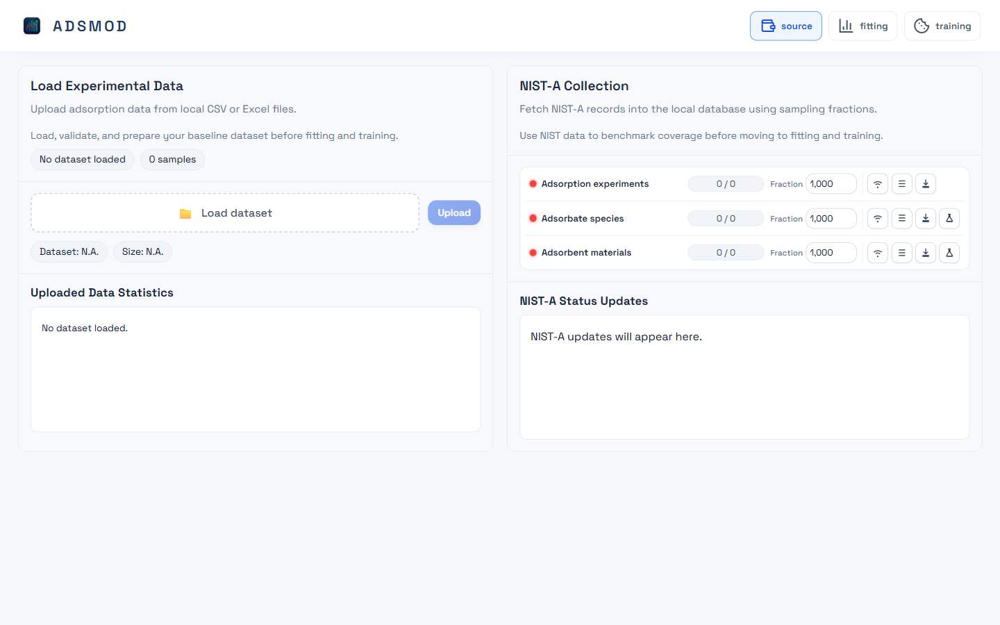
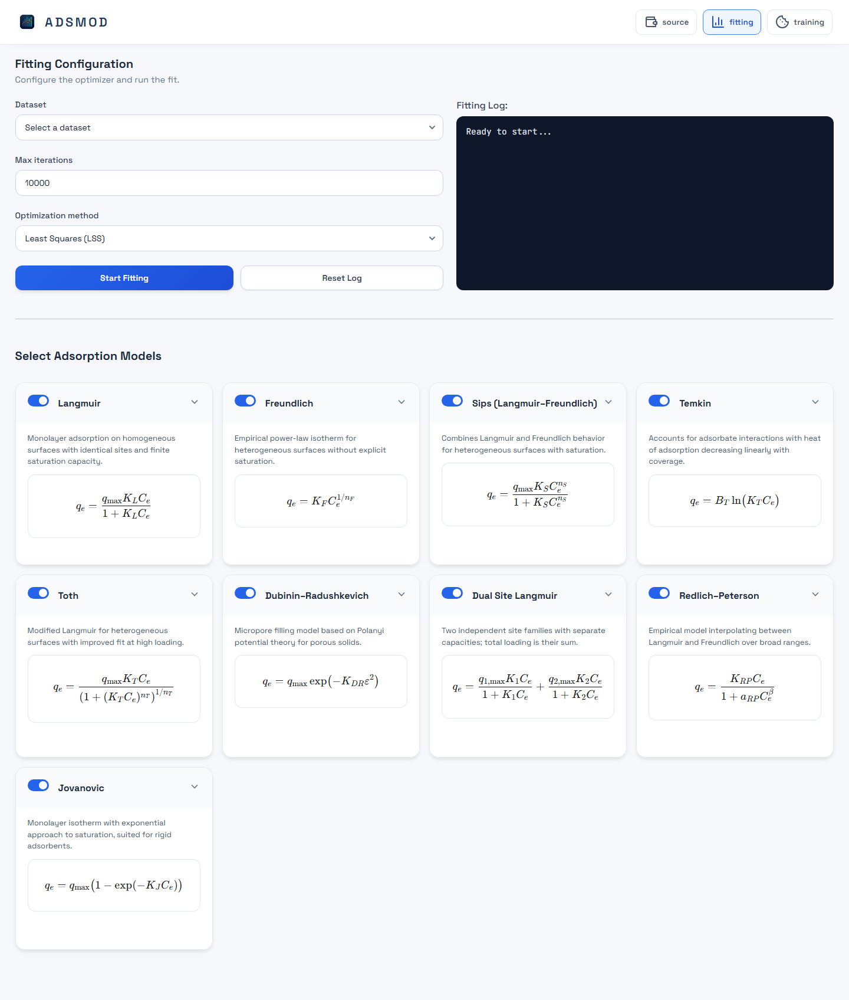
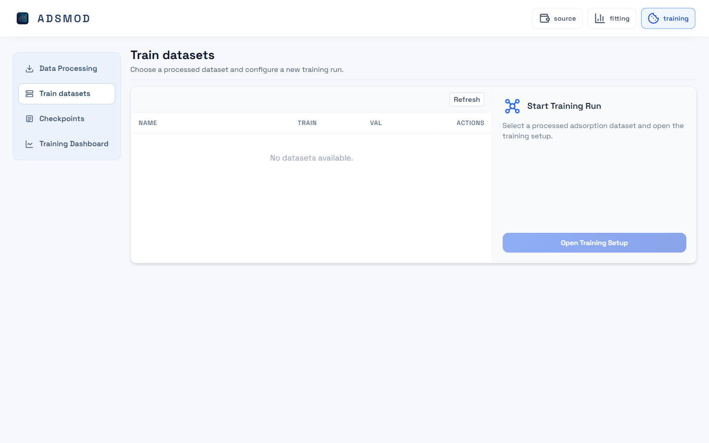

# ADSMOD Adsorption Modeling

[](https://github.com/CTCycle/ADSMOD-Adsorption-Modeling/releases)
[](https://www.python.org/)
[](https://nodejs.org/)
[](LICENSE)
[](https://github.com/CTCycle/ADSMOD-Adsorption-Modeling/actions/workflows/ci.yml?query=branch%3Adevelop)

Last updated: 2026-08-30

## Purpose

ADSMOD collects adsorption isotherms, enriches materials with NIST and PubChem
data, standardizes datasets, fits adsorption models, and trains SCADS machine
learning models through one Angular web application.

## Canonical architecture

- `app/client` is the Angular user interface.
- `app/backend/common` (`adsmod-common`) contains framework-neutral contracts,
  health, paths, version data, and the validated configuration model.
- `app/backend/core` (`adsmod-core`) owns the operational database, Alembic
  migrations, dataset/NIST/fitting workflows, and immutable training snapshots.
- `app/backend/ml` (`adsmod-ml`) owns training, model execution, checkpoints,
  and the authenticated Core snapshot client. It does not access the Core ORM.
- `app/resources/adsmod.json` is the only runtime configuration file.

Core and ML expose separate versioned APIs. The client proxy routes
`/api/v1/training` to ML and the general `/api/v1` surface to Core. Both
services expose `/health/live` and `/health/ready`.

## Windows setup

Run the menu-driven launcher from the repository root:

```powershell
powershell -ExecutionPolicy Bypass -File .\start_on_windows.ps1
```

The launcher provisions portable runtimes under `runtimes/`, installs the
locked backend workspace into `app/backend/.venv`, runs `npm ci`, builds the
Angular bundle, starts the configured services, and opens the local preview.
The selected `runtime.mode` in `app/resources/adsmod.json` controls whether ML
is started.

## Manual setup

```powershell
& .\runtimes\uv\uv.exe sync --locked --project .\app\backend --all-packages --group dev
Set-Location app/client
npm ci
npm run build
```

Start Core from the repository root:

```powershell
& .\app\backend\.venv\Scripts\python.exe -m adsmod_core.cli --config .\app\resources\adsmod.json
```

For `core-ml` mode, start ML in another terminal:

```powershell
& .\app\backend\.venv\Scripts\python.exe -m adsmod_ml.cli --config .\app\resources\adsmod.json
```

Run the Angular development server from `app/client` with `npm run dev`.

## Runtime configuration

`app/resources/adsmod.json` defines the runtime mode, loopback hosts, Core/ML/
frontend ports, storage root, database, security, fitting defaults, training
defaults, and polling intervals. `app/resources/adsmod.schema.json` is generated
from `adsmod_common.config.AdsmodConfig`.

Relative database paths are resolved below the configured storage root. The
default embedded database is `%LOCALAPPDATA%/ADSMOD/data/database.db`.

## Main workflows

- Import `.csv`, `.xls`, or `.xlsx` adsorption data and review detected columns.
- Fetch and enrich NIST adsorption and material data.
- Select models, run fittings, and inspect persisted metrics.
- In `core-ml` mode, build training snapshots, start/resume training, and
  inspect checkpoints and progress.

Representative UI documentation is available in `assets/figures/`:







## Testing and validation

```cmd
app\tests\run_tests.bat
```

The test runner reads the canonical config, starts only the services required
by the selected mode, and stores disposable artifacts under `app/tests/cache`.
Direct Python validation uses the backend environment:

```powershell
& .\app\backend\.venv\Scripts\python.exe -m pytest app\tests -v --basetemp app\tests\cache\pytest-tmp-local
```

For frontend changes, run `npm run lint`, `npm run test`, and `npm run build`
from `app/client`. CI regenerates and checks both service OpenAPI snapshots and
the configuration schema.

## Resources and maintenance

- Storage root: logs, embedded database, ML artifacts, and checkpoints.
- `runtimes/cache`: disposable uv, npm, pip, and runtime cache data.
- `app/tests/cache`: disposable test, coverage, frontend, and Python cache data.
- `app/backend/openapi`: generated Core and ML OpenAPI snapshots.

Use the launcher menu for database initialization, log removal, cache cleanup,
checkpoint cleanup, frontend rebuilding, dependency updates, and uninstall.
Database initialization is repeatable and refuses unknown unversioned schemas.

Detailed guidance is in [`assets/docs/project_index.md`](assets/docs/project_index.md).

## License

This project is licensed under the MIT License. See [`LICENSE`](LICENSE).
