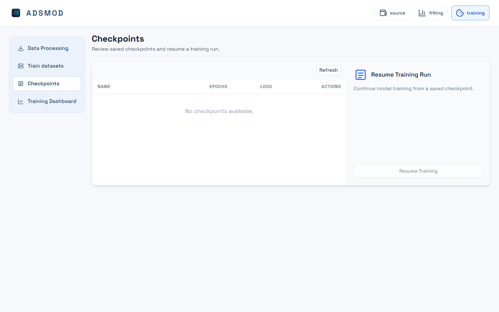
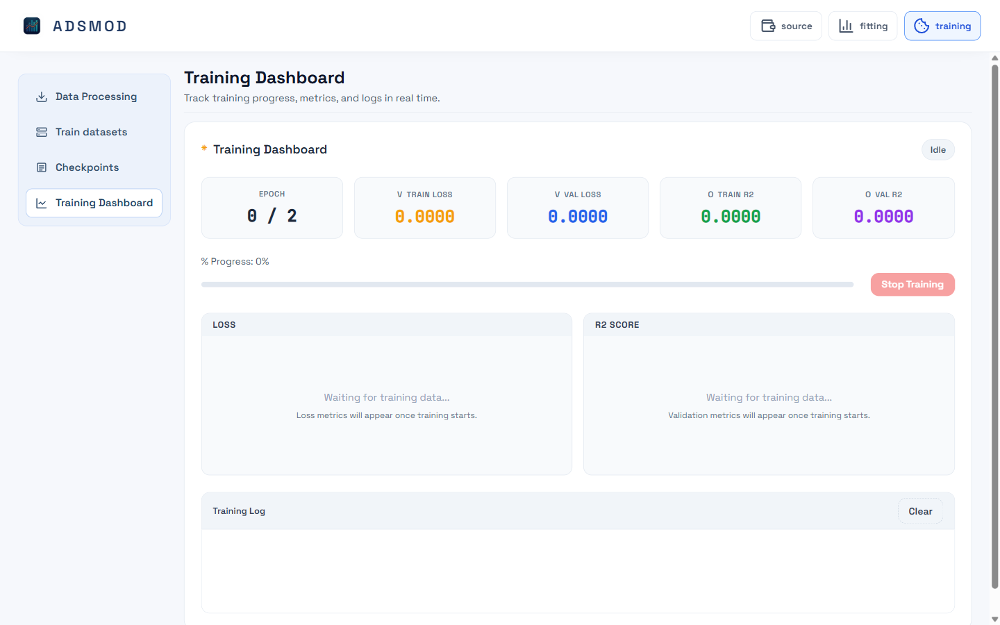

# ADSMOD Adsorption Modeling
[](https://github.com/CTCycle/ADSMOD-Adsorption-Modeling/releases)
[](https://www.python.org/)
[](https://nodejs.org/)
[](LICENSE)
[](https://ctcycle.github.io/CTCycle/)
[](https://github.com/CTCycle/ADSMOD-Adsorption-Modeling/actions/workflows/ci.yml?query=branch%3Adevelop)

Last updated: 2026-08-20

## 1. Project Overview

ADSMOD is a comprehensive web application designed for the collection, management, and modeling of adsorption data. This project represents the evolution and unification of two predecessor projects: **ADSORFIT** and **NISTADS Adsorption Modeling** (the former name of this repository).

### Current service and frontend split

- Transitional application runtime:
  - `app/server/core_service` (health, datasets, NIST, and fitting workflows)
  - `app/server/ml_service` (training datasets, checkpoints, and training lifecycle)
  - `app/server/shared` (shared persistence, schemas, and repositories)
- Canonical v3 packages:
  - `app/backend/common` (`adsmod-common` contracts)
  - `app/backend/core` (`adsmod-core` health, capabilities, and snapshots)
  - `app/backend/ml` (`adsmod-ml` ML health, capabilities, and snapshot client)
- Frontend: `app/client` (Angular UI for datasets, fitting, dashboards, and training)
- In development proxy mode, `/api/training/*` targets the optional ML service and other `/api/*` traffic targets the core service.

The launcher-selected `app/server` runtime and the extracted `app/backend` v3
packages are documented separately in
[`assets/docs/architecture/overview.md`](assets/docs/architecture/overview.md).
The active runtime is the current HTTP contract; v3 cutovers replace each
vertical slice atomically and delete the superseded implementation. No internal
compatibility aliases or fallback configuration paths are provided.

By merging the capabilities of these systems into a single, cohesive platform, ADSMOD provides a robust workflow for researchers and material scientists. The application allows users to:
- **Collect** adsorption isotherms from the NIST Adsorption Database.
- **Enrich** material data with chemical properties fetched from PubChem.
- **Build** curated, standardized datasets suitable for machine learning.
- **Train and Evaluate** deep learning models to predict adsorption behaviors.

The system is organized as a modern web application with a responsive user interface and a backend focused on data processing and machine learning tasks.

## 2. Model and Dataset

This project utilizes deep learning techniques to model adsorption phenomena.

- **Model**: The core learning capability is based on the **SCADS** model architecture.
- **Learning**: The system relies on **Supervised Learning**, using historical experimental data to train predictive models.
- **Dataset**:
  - **Primary Source**: Experimental adsorption isotherms from the **NIST Adsorption Database**.
  - **Enrichment**: Chemical properties (for example molecular weights and SMILES strings) from **PubChem**.
  - The application handles fetch, cleanup, and merge steps to produce training-ready datasets.

## 3. Installation

### 3.1 Windows (One Click Setup)

ADSMOD provides an automated menu-driven launcher and maintenance script for Windows users.

1. Navigate to the `ADSMOD` directory.
2. Run `powershell -ExecutionPolicy Bypass -File .\start_on_windows.ps1`.

**What this script does:**
- Downloads portable Python, uv, and Node.js runtimes into `runtimes/` (first run only).
- Installs backend dependencies into `app/server/.venv`.
- Installs frontend dependencies as needed; menu option 2 always rebuilds the unified frontend bundle, and menu option 3 can rebuild it independently.
- Starts the unified local web backend and frontend preview.
- Exposes setup, test, cleanup, database initialization, and uninstall actions.

**First Run vs. Subsequent Runs:**
- On the **first run**, setup may take time because runtimes and dependencies are downloaded.
- On **subsequent runs**, launch is faster because setup is reused.

### 3.2 Manual Setup (Advanced)

If you prefer manual setup or are running outside the launcher workflow:
1. Install Python and Node.js.
2. For core-only usage, run `uv sync --package adsmod-core-service --group dev` from `app/server`.
3. For ML/training support, run `uv sync --package adsmod-ml-service --group dev` from `app/server`, or `uv sync --all-packages --group dev` when explicitly validating both services.
4. Install frontend dependencies in `app/client`.
5. Launch backend and frontend processes.

### Backend startup commands

```cmd
app\server\.venv\Scripts\python.exe -m uvicorn app.server.app:app --host 127.0.0.1 --port 6045
cd app\client
npm run dev
```

The optional ML service uses port `6046` from `app/resources/adsmod.json`. The
Windows launcher starts the unified core web runtime; training becomes available
when the ML service is also running or the unified backend is started with
`ADSMOD_ENABLE_ML=true`.

## 4. How to Use

### 4.1 Launching the Application

**Windows:**
Run `powershell -ExecutionPolicy Bypass -File .\start_on_windows.ps1` and select **Launch application**. The launcher starts the unified backend and frontend preview, waits for both to respond, and opens the local web UI.

### 4.2 Runtime configuration

Hosts, ports, storage, and application defaults are read from the canonical file:

- `app/resources/adsmod.json`

Its shape is validated only by `adsmod_common.config.AdsmodConfig`; the checked-in
`app/resources/adsmod.schema.json` is generated from that model. Transport and
workflow Pydantic types live under service/shared `contracts` packages.

Use `settings/.env` for operational toggles such as log visibility, reload, and
scientific backend selection. `ADSMOD_RESOURCES_DIR` may
override the default `app/resources` directory for the canonical configuration,
logs, templates, checkpoints, and embedded SQLite database. Relative paths are
resolved from the repository root. Runtime hosts and ports do not belong in
`.env`. The launcher creates `settings/.env` from
`settings/.env.example` when it is missing and never overwrites an existing
file. Local `.env` files are ignored by Git.

### 4.3 Operational Workflow and UI Snapshots

The application workflow is exposed through one frontend:
- `datasets` (workspace datasets, file import, and NIST-A collection)
- `dashboards` (current placeholder workspace view)
- `fitting`
- `training` with `processing`, `datasets`, `checkpoints`, and `dashboard` views

The snapshots below are representative UI documentation images; they are not a
release-status claim.

#### 4.3.1 Data Source Configuration

- Upload local `.csv` or `.xlsx` adsorption data.
- Collect and enrich adsorption data from NIST-A.
- Monitor ingestion and enrichment progress from the UI.


*Source tab: upload local datasets, review sample/size metadata, and run NIST-A collection tools.*

#### 4.3.2 Models and Fitting

- Select a workspace dataset created by upload or NIST collection.
- Configure optimizer settings and fitting iterations.
- Select adsorption models and run fitting.
- Review fit status and logs.


*Fitting tab: choose adsorption models, configure optimization, and inspect fitting logs.*

#### 4.3.3 Training

- Build machine-learning-ready datasets.
- Configure and start new training experiments.
- Resume previous runs from checkpoints.
- Monitor run status and metrics from the dashboard.

*Train Datasets view: pick a processed dataset and launch a training setup.*


*Checkpoints view: review saved checkpoints and resume previous experiments.*



*Training Dashboard view: track run progress and monitor key training metrics.*



## 5. Setup and Maintenance

Run `powershell -ExecutionPolicy Bypass -File .\start_on_windows.ps1` to access setup and maintenance actions:

- **Remove logs**: clears `.log` files under the configured resource directory.
- **Install or update dependencies**: prepares shared runtimes, backend dependencies, and the unified frontend.
- **Rebuild frontend**: installs frontend packages and rebuilds the unified frontend bundle without syncing backend dependencies.
- **Uninstall application**: removes local runtime and build artifacts while preserving settings, resources, the database, and user data.
- **Initialize database**: explicitly initializes PostgreSQL, or creates a
  missing SQLite database. Existing SQLite files are left unchanged.
- **Clear cache**: removes Python bytecode caches and the uv cache.

### 5.1 Frontend Development Commands

From `app/client`:

```bash
npm install
npm run dev
npm run build
```

Frontend API base path defaults to `/api`; the Angular development server routes `/api/training/*` to the ML service and all other `/api/*` calls to the core service through `app/client/proxy.conf.cjs`.

## 6. Resources

The application stores data and artifacts in specific directories:

- **checkpoints**: trained model weights, training history, and model configuration files under `<resource directory>/checkpoints`.
- **database**: local SQLite database at `<resource directory>/database.db` for metadata and experiment indexes when embedded mode is selected. PostgreSQL is initialized only through the explicit launcher command.
- **logs**: application logs under `<resource directory>/logs`.
- **runtimes**: portable Python/uv/Node.js downloaded by the Windows launcher.
- **runtime venv**: backend virtual environment at `app/server/.venv`.
- **runtime lockfile**: backend lockfile at `app/server/uv.lock`.
- **templates**: starter assets under `<resource directory>/templates`.

## 7. Configuration

Runtime hosts, ports, database mode, and backend defaults are loaded from
`app/resources/adsmod.json`.

`.env` runtime keys used by the launcher, tests, and frontend startup:

| Variable | Description |
|---|---|
| `KERAS_BACKEND`, `MPLBACKEND` | ML/scientific runtime backend configuration. |
| `RELOAD` | Uvicorn reload toggle for local development. |
| `BACKEND_LOGS_VISIBLE` | Set to `true` to show backend logs in a dedicated terminal; defaults to `true` when absent. |
| `VITE_API_BASE_URL` | Optional frontend API base path written into runtime config; same-origin `/api` is used by default. |
| `ADSMOD_RESOURCES_DIR` | Optional resource root; defaults to `app/resources` and includes the embedded SQLite database. Relative paths are resolved from the repository root. |

Single canonical runtime file:
- `app/resources/adsmod.json`

## 8. Development Status

The repository and canonical configuration are versioned `3.0.0`. The extracted
v3 packages are present, while the Windows launcher still starts the transitional
`app/server` web runtime. The project remains under active development, and the
v3 launcher/service integration is not yet complete.

## 9. License

This project is licensed under the **MIT License**. See `LICENSE` for full terms.

