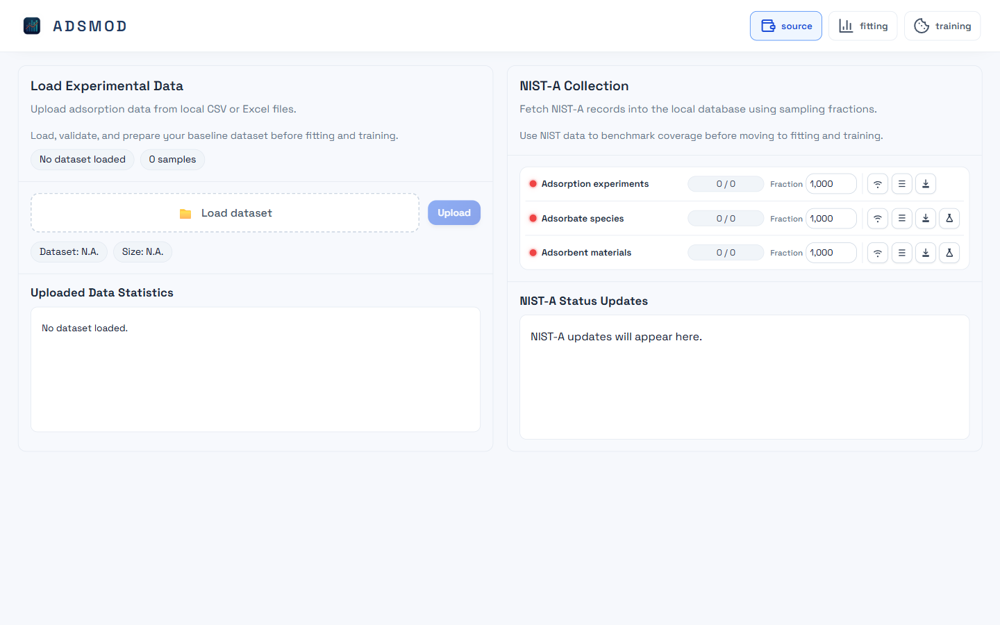
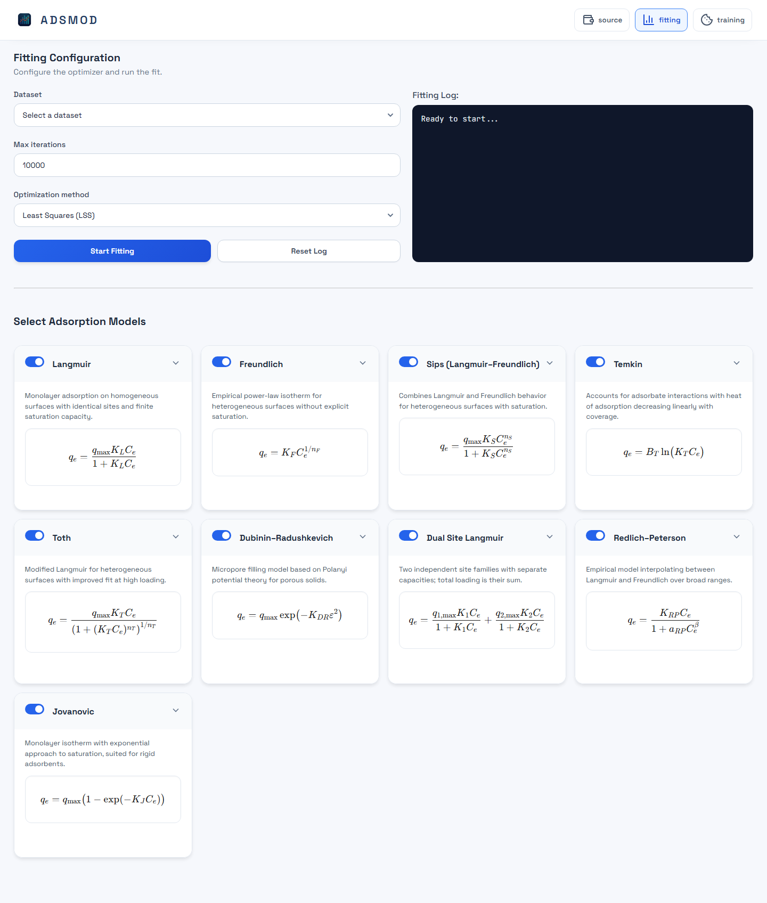

# ADSMOD Adsorption Modeling

[](https://github.com/CTCycle/ADSMOD-Adsorption-Modeling/releases)
[](https://www.python.org/)
[](https://nodejs.org/)
[](LICENSE)
[](https://github.com/CTCycle/ADSMOD-Adsorption-Modeling/actions/workflows/ci.yml?query=branch%3Adevelop)

Last updated: 2026-09-30

ADSMOD is a local, Windows-first web application for organizing adsorption data
and turning it into an inspectable analysis workflow. It combines local dataset
import, public reference data, adsorption-model fitting, and an optional machine-
learning workspace in one application.

## Current application

The current implementation is the v3 line documented on `develop`:

- Angular browser client in `app/client`;
- one FastAPI backend in `app/server`;
- SQLite by default, with the typed database configuration also supporting
  PostgreSQL;
- canonical configuration in `data/adsmod.json`;
- optional ML dependencies loaded into the same backend process; and
- a Windows launcher that provisions portable Python, uv, and Node.js runtimes.

The application is local and single-workspace by default. Public-data actions
depend on the external NIST, PubChem, or COD services when retrieval is requested.

## Start on Windows

From the repository root:

```powershell
powershell -ExecutionPolicy Bypass -File .\start_on_windows.ps1
```

Choose **Launch Application** in the menu. The launcher prepares dependencies,
builds or reuses the Angular bundle, starts the backend and production preview,
waits for readiness, and opens the local address it reports. Use **Stop
application** in the same session to stop only processes started by that session.

The first launch can take longer because portable runtimes and packages may need
to be downloaded. The documented one-command workflow is currently Windows-only;
advanced manual startup notes are in
[`assets/docs/runtime/startup.md`](assets/docs/runtime/startup.md).

## Main workflows

- **Custom Datasets** (`/datasets`) imports `.csv`, `.xls`, and `.xlsx` files,
  previews and maps columns, validates units and experiment grouping, and keeps
  the saved dataset inspectable across reloads.
- **Public Data** (`/public-data/:view`) contains the Overview, Adsorption Data,
  Materials, Chemicals, Structures, and Sources views. NIST acquisition, PubChem
  resolution, and COD structure import are separate provider actions with source
  provenance.
- **Fitting** (`/fitting`) compares enabled adsorption models asynchronously,
  reports metrics and logs, persists completed results, and supports cancellation
  and recovery. A numerical fit is a comparison aid, not proof of a physical
  mechanism.
- **Training** (`/training/:view`) is shown only when the optional ML profile is
  available. Its views cover data processing, training datasets, checkpoints, and
  the populated training dashboard.
- **Dashboards** (`/dashboards`) is currently a contained placeholder for a
  future general workspace dashboard; it is separate from the validated training
  dashboard.

Representative current views:





## Runtime and data

The launcher and frontend development proxy read `data/adsmod.json` by default.
Use `-DataPath` or `ADSMOD_DATA_DIR` to select another configuration directory:

```powershell
powershell -ExecutionPolicy Bypass -File .\start_on_windows.ps1 -DataPath .\alternate-data
```

The configured storage root contains the embedded database, logs, checkpoints,
and optional ML artifacts. The base profile intentionally reports ML as
unavailable and does not expose training routes. The ML profile adds the training
routes in-process; it does not start a second backend.

## Maintainer commands

Use the launcher for normal setup and maintenance. For development or focused
validation, see
[`assets/docs/operations/commands.md`](assets/docs/operations/commands.md).
The main entry points are:

```cmd
app\tests\run_tests.bat
```

```powershell
Set-Location app\client
npm run lint
npm run test:unit
npm run test:preview
npm run build
```

The canonical OpenAPI snapshot includes ML routes and must be generated with the
ML-enabled backend profile. The generator fails closed under the Base profile so
it cannot overwrite the canonical contract with a reduced one.

## Current limitations

- Some NIST measurements are intentionally skipped when the source units or
  metadata do not support a safe conversion; ADSMOD does not infer one.
- Provider availability, response time, and secondary PubChem endpoints are
  external conditions, not local guarantees.
- The validated ML lifecycle uses a small synthetic fixture and does not establish
  model quality, convergence, long-duration stability, or release readiness.
- The current rendered/keyboard/responsive checks do not constitute a complete
  product-wide screen-reader review.

The current status, evidence boundaries, open limitations, and revalidation map
are maintained in
[`assets/docs/project_status_ledger.md`](assets/docs/project_status_ledger.md).
The documentation map begins at
[`assets/docs/project_index.md`](assets/docs/project_index.md).

## Branch baseline

This README describes the v3/Angular application on `develop`. The local
`main`/`origin/main` refs still contain the older React/Tauri-era application
shape and have not yet been reconciled with this line. See the status ledger for
the exact ref state and the remaining integration follow-up.

## License

This project is licensed under the MIT License. See [`LICENSE`](LICENSE).
