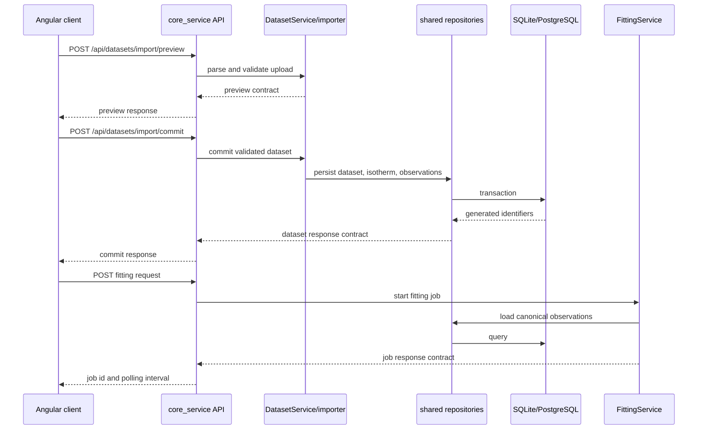
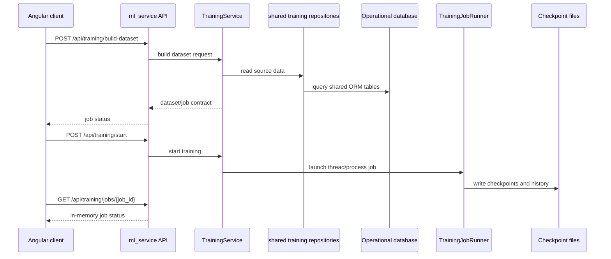
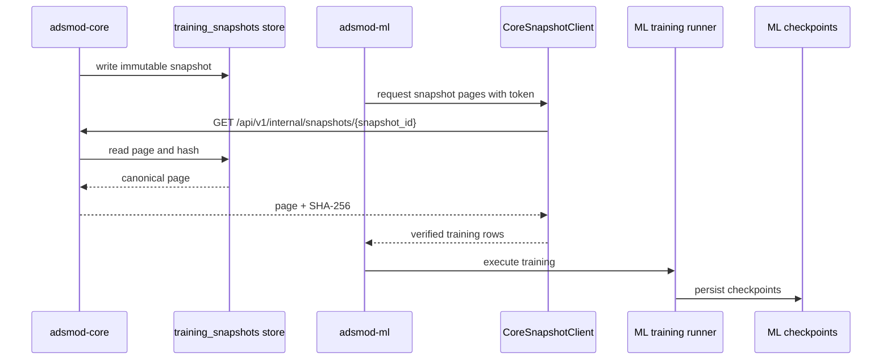

# ADSMOD API Surface

Last updated: 2026-08-20

## Core Service Scope

The transitional core service owns non-ML routes only:

- health and root routes
- dataset upload, import preview, metadata, row, and read flows outside training-only workflows
- fitting routes
- NIST and source-collection routes
- canonical user-dataset management routes:
  - `GET /api/datasets`
  - `POST /api/datasets/import/preview`
  - `POST /api/datasets/import/validate`
  - `POST /api/datasets/import/commit`
  - `DELETE /api/datasets/{dataset_id}`
  - `PATCH /api/datasets/{dataset_id}/rename`
  - `PATCH /api/datasets/{dataset_id}/metadata`
  - `GET /api/datasets/{dataset_id}/experiments`
  - `GET /api/datasets/{dataset_id}/experiments/{isotherm_id}/observations`

Dataset metadata is part of the current schema; existing databases must be
recreated. Dataset and experiment selection uses numeric IDs. Fitting accepts a
`dataset_id` and optional `isotherm_id` and resolves the persisted series
server-side.

Core service must not expose `/api/training/*`.
`app/server/app.py` composes the core routes in the unified backend. When
`ADSMOD_ENABLE_ML=true`, it also mounts the ML routes in that same application;
route ownership remains with `ml_service`.

## ML Service Scope

ML service owns training workflows:

- `/api/training/datasets`
- `/api/training/dataset-sources`
- `/api/training/build-dataset`
- `/api/training/processed-datasets`
- `/api/training/dataset-info`
- `/api/training/dataset`
- `/api/training/jobs`
- `/api/training/jobs/{job_id}`
- `/api/training/checkpoints`
- `/api/training/checkpoints/{checkpoint_name}`
- `/api/training/start`
- `/api/training/resume`
- `/api/training/stop`
- `/api/training/status`

Training routes belong only to `ml_service`, even when they are mounted by the unified backend entrypoint.
Core-only launch paths must not import `ml_service`. The extracted v3 packages
currently expose their separate `/health/*`, `/api/v1/system/capabilities`, and
core snapshot contracts; they do not replace this transitional `/api` surface.

## Shared OpenAPI Snapshot

`app/shared/openapi.json` is the tracked OpenAPI snapshot for the unified
`app.server.app:app` entrypoint with `ADSMOD_ENABLE_ML=true`. It contains both
core and training routes. The service-specific `core_openapi.json` and
`ml_openapi.json` snapshots remain available for isolated service consumers.

OpenAPI is a derived contract: regenerate it from the running FastAPI
applications after route changes; do not edit the snapshots as source files.

## Critical flows

### Dataset import and fitting (current runtime)

The current job state is held by the in-memory shared `JobManager`; it is not a
durable queue. Fitting results are persisted in `fitting_runs`, `fit_results`,
and `fit_parameters`.

### Training data and execution (current runtime)

### Training data and execution (target v3 flow)

The v3 flow removes ML's direct access to the operational database. It is a
target migration, not the behavior of the launcher-selected runtime today.
