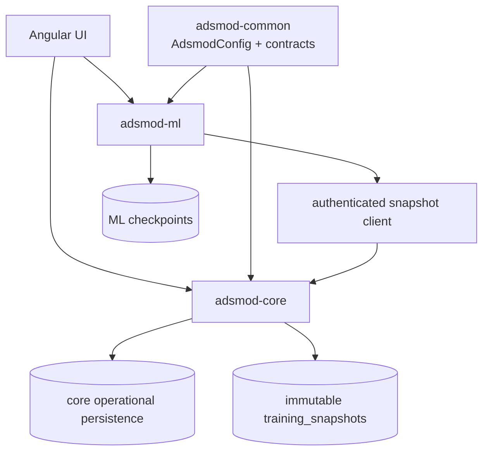

# Architecture Findings And Remediation

Last updated: 2026-08-20

This is the canonical review record for the repository-wide architecture
assessment. It distinguishes the launcher-selected runtime from the incomplete
v3 package runtime and records only issues evidenced by the current source.

## Current state

The launcher starts one Angular UI and the transitional `app/server` backend.
The unified FastAPI entrypoint composes `core_service` and optional
`ml_service` routes. The services share a SQLAlchemy operational database,
repository layer, in-memory job manager, and shared contracts. The extracted
v3 packages under `app/backend` provide a stricter package boundary:
`adsmod-common` owns configuration/contracts, `adsmod-core` owns health and an
immutable snapshot store, and `adsmod-ml` consumes snapshots through an
authenticated client. The launcher does not start those packages yet.

## Strengths

- The active service dependency direction is explicit: both services depend on
  `shared`, and `shared` imports neither service.
- Core excludes ML-heavy dependencies and ML routes remain isolated behind the
  explicit `ADSMOD_ENABLE_ML` composition switch.
- NIST persistence has one repository owner and provider-frame conversion has a
  named mapper boundary.
- The twelve-table ORM model has meaningful uniqueness, check constraints,
  relationship cascades, and indexes; schema tests exercise the metadata.
- v3 snapshot pages are authenticated, hashed, and paginated, giving the future
  ML boundary a concrete contract.
- Configuration shape, runtime values, transport contracts, persistence
  metadata, and OpenAPI outputs now each have one documented source of truth.

## Findings

Severity is a prioritization aid, not a claim that every item blocks delivery.

| Priority | Location | Finding and impact | Preferred solution | Timing |
|---|---|---|---|---|
| **P0** | None confirmed | No correctness or security issue was found that requires an immediate stop-ship change. | Keep the focused boundary tests and generated-contract checks in CI. | Ongoing |
| **P1** | `app/server` vs `app/backend` and launcher scripts | Active-versus-v3 ownership is easy to confuse. New work can land in the wrong generation or duplicate a workflow. | Document the two runtimes separately, migrate by vertical slice, switch every caller atomically, and delete the replaced implementation. | Documentation is immediate; runtime cutover is incremental. |
| **P1** | `app/server/ml_service` and `app/server/shared/shared/repositories` | Active ML training reads shared repositories and the operational database directly. ML is coupled to ORM/persistence details and core schema changes can break training. | Publish training snapshots from v3 core, update ML to the authenticated snapshot contract, then delete direct shared-database readers. | Incremental, after each snapshot-backed workflow is proven. |
| **P1** | Repository database setup | There is no Alembic migration history; `Base.metadata.create_all` initializes the current schema. Reproducible upgrades and rollback history are therefore absent. | Add one Alembic baseline for the existing SQLite/PostgreSQL model before the first schema change. Keep ORM metadata as the desired-current-schema authority. | Deferred until a schema change is required. |
| **P1** | `FittingRun.best_result_id` and fitting references | `best_result_id` is a nullable integer without a foreign key, and dataset/isotherm/component references are repeated without a database consistency constraint. Invalid references can be stored. | In a later migration, add the FK and either remove redundant references or enforce their consistency. | Deferred with the schema baseline. |
| **P1 resolved** | `adsmod_common.config` and `shared.common.settings` | Duplicate Pydantic validators, JSON parsing, and dictionary accessors could accept different configuration shapes and drift from the checked-in schema. | `AdsmodConfig` is now the only shape validator; shared settings are typed projections and `adsmod.schema.json` is generated from it. | Completed in this work. |
| **P1 resolved** | `.github/workflows/ci.yml` and `app/backend/*/tests` | The extracted v3 tests were not part of the normal CI path. Boundary regressions could pass unnoticed. | Run all 13 v3 tests from the repository root with explicit source paths and static dependency checks. | Completed in this work. |
| **P2 resolved** | `core_service/domain`, `ml_service/domain`, shared job models | The folders contained Pydantic transport/workflow contracts, not domain entities or aggregates. The name implied a domain model that the code did not have. | Rename to `contracts`, move shared jobs to `shared/contracts`, update all callers, and delete retired paths. | Completed in this work. |
| **P2 resolved** | Core and ML unit conversion modules | Pressure/uptake aliases and formulas were duplicated, risking conversion drift. | Keep one `shared.services.units.UnitRegistry`; ML retains only DataFrame orchestration and parity tests cover prior units. | Completed in this work. |
| **P2** | NIST, training, and import services | Several services coordinate provider access, persistence, transformation, jobs, and response shaping. They are broad but currently cohesive enough to change safely. | Split only when a demonstrated change isolates one responsibility; preserve named service ownership rather than adding generic layers. | Incremental, feature-led. |
| **P2** | API routers and response factories | Similar HTTP error translation and response construction occurs across route modules. Inconsistency is possible, but the current public behavior is stable. | Consolidate only repeated, behaviorally identical translation after contract tests exist. | Deferred. |
| **P2** | Launcher/unified composition and process orchestration | Startup logic is spread across launcher scripts, unified app composition, and service containers. The function-local ML import is a real but contained composition gap. | Retire `app.server.app` after v3 services are launched directly; then remove the function-local optional import. | Deferred to launcher cutover. |
| **P3** | `shared.services.jobs.JobManager` and v3 snapshot retention | Job state is in memory and snapshots have no retention policy. A restart loses active job state, but no restart-durability requirement is currently established. | Accept until durability or retention becomes a product requirement; then add the smallest persistence/retention mechanism that satisfies it. | Optional. |

## Target state

Core owns operational persistence and immutable snapshots. ML owns training
execution and checkpoints and receives training data through the snapshot
contract. The UI remains one application; separate service processes are an
operational boundary, not a reason to introduce additional layers or queues.

## Remediation sequence

1. Keep the generated config schema and v3 boundary tests as required CI gates.
2. Migrate datasets, NIST, and fitting into v3 core one vertical slice at a
   time; update all callers and delete each replaced transitional path in the
   same change.
3. Migrate ML training reads to immutable snapshots, verify content hashes and
   parity, then delete shared repository/database access from ML.
4. Add the Alembic baseline before changing the twelve-table schema. Add the
   fitting-result FK and consistency constraints only when their migration is
   scheduled.
5. Start v3 services directly from the launcher, retire `app.server.app`, and
   remove the function-local optional ML import.
6. Split broad services or repeated router/error handling only when a concrete
   feature demonstrates a cohesive seam.

No step introduces legacy aliases, re-exports, fallback configuration paths,
dual readers, generic repositories, speculative queues, or extra framework
layers. Each internal replacement is atomic: update every caller, then delete
the superseded implementation.
