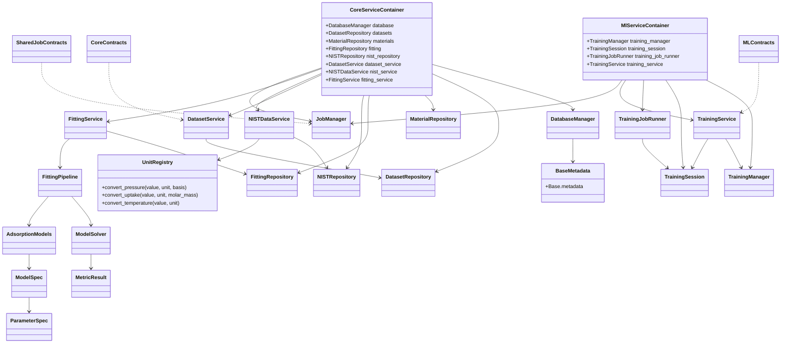
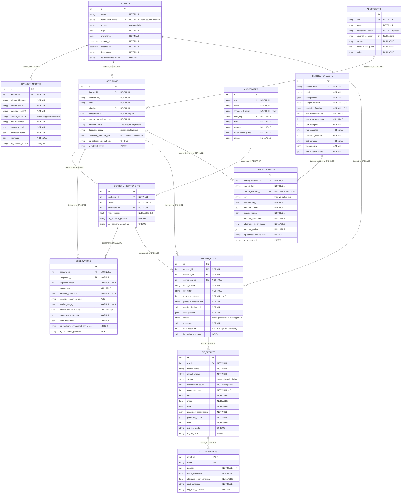
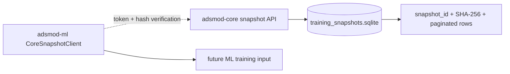

# ADSMOD Persistence And Packages

Last updated: 2026-08-20

## Package and persistence ownership

The active backend workspace is `app/server` with one lockfile at
`app/server/uv.lock` and three packages: `shared`, `core_service`, and
`ml_service`.

- `shared.repositories.database.manager.DatabaseManager` owns engine/session
  construction, SQLite pragmas, disposal, and transaction context.
- `shared.repositories.schemas.models.Base.metadata` is the source of truth for
  the twelve operational SQLAlchemy tables.
- Typed repositories in `shared.repositories` own SQL projections and conflict
  targets. `repositories/nist.py` is the sole canonical NIST persistence owner;
  `repositories/queries` contains training-specific query helpers.
- `core_service.services.data.nist_mapper.NISTCanonicalMapper` converts
  provider frames before they enter the shared NIST repository.
- `shared.services.units.UnitRegistry` owns canonical pressure, uptake, and
  temperature parsing/conversion. ML retains DataFrame column orchestration
  only.
- `ml_service` owns model serialization, training execution, and checkpoint
  files, but its active data reads still cross the shared repository boundary.
- `adsmod-core` has a separate immutable `training_snapshots` SQLite store. It
  is not one of the twelve transitional ORM tables.

The active database is managed by the Alembic environment under
`app/server/migrations`. Its reviewed baseline represents the existing
SQLite/PostgreSQL model, and every startup or explicit initialization upgrades
the database to the packaged Alembic head. `Base.metadata` remains the
desired-current-schema authority for autogeneration and drift checks; migration
scripts remain the immutable schema-evolution history.

## Transitional ORM class map

The `contracts` nodes are Pydantic request/response/workflow types, not ORM
entities. The SQLAlchemy classes below are persistence models and should not be
reused as transport contracts.

## Transitional database ER diagram

The diagram records the current metadata, including nullable foreign keys,
database cascades, relationship cascades, constraints, and the indexes that
matter to repository access. Relationship labels use `CASCADE`, `RESTRICT`, or
`SET NULL` where the model declares an `ondelete` action.

## v3 snapshot store

The extracted core package owns a separate SQLite file for immutable training
snapshots. The ML package accesses it only through authenticated HTTP, not by
opening the file or importing the core package.

This store is the target replacement for ML reads from the transitional shared
database. Snapshot retention is intentionally deferred until restart durability
or retention requirements are demonstrated.

## Validation expectations

- Run schema-contract tests against `Base.metadata` and the generated OpenAPI
  snapshots from the running apps.
- Regenerate `app/resources/adsmod.schema.json` from `AdsmodConfig`; a second
  generation must produce no diff.
- Do not hand-edit either generated schema or OpenAPI snapshots.
- Before schema changes, add the Alembic baseline described above. A later
  migration should make `FittingRun.best_result_id` a real foreign key and
  either remove or constrain redundant dataset/isotherm/component references.
