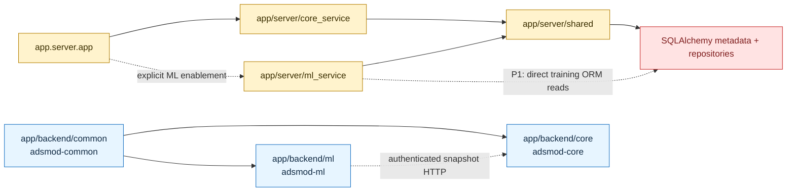
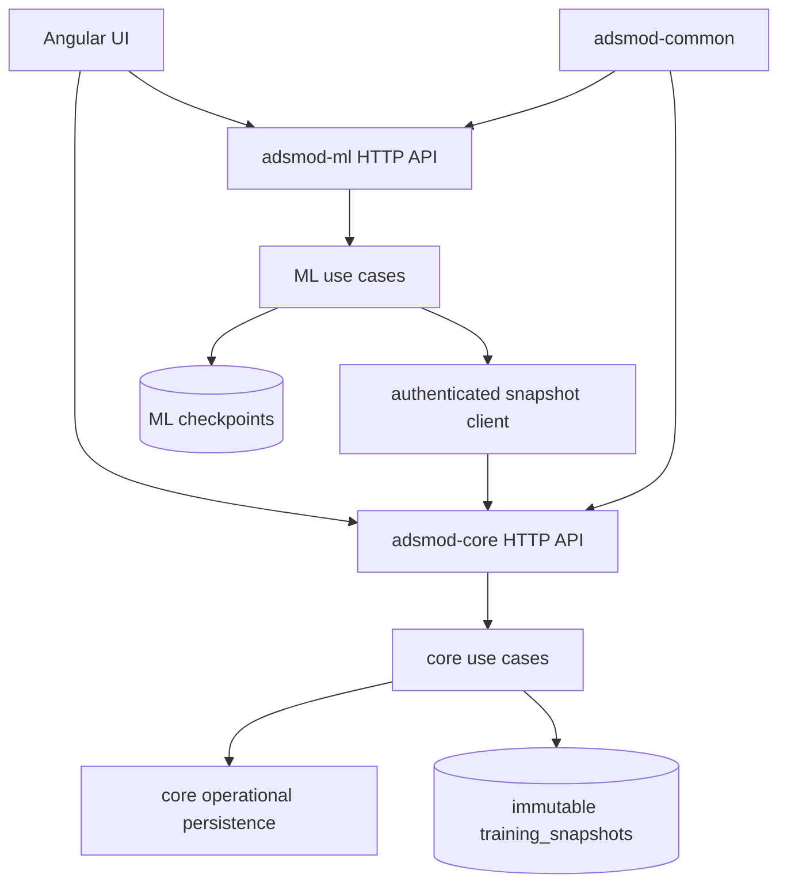

# ADSMOD Service Boundaries

Last updated: 2026-08-20

## Current dependency direction

The active workspace has one intentional shared dependency direction:

- `core_service -> shared`
- `ml_service -> shared`
- `shared -> no service package`
- `app.server.app` composes both services at the HTTP boundary only when ML is
  explicitly enabled.

The v3 packages are separate from that graph:

- `adsmod-core -> adsmod-common`
- `adsmod-ml -> adsmod-common`
- `adsmod-ml` calls the `adsmod-core` snapshot HTTP contract; it does not import
  `adsmod-core` or the active service workspace.

The highlighted active graph is the runtime used by the launcher today. The
v3 graph is the target ownership boundary already present in source, but it is
not yet the launcher-selected runtime.

## Ownership rules

- `core_service` owns non-ML route handlers and application orchestration for
  datasets, NIST, and fitting.
- `ml_service` owns training route handlers, data preparation, model execution,
  checkpoints, and training lifecycle orchestration.
- `shared` owns database/session infrastructure, the twelve-table ORM schema,
  typed repositories, shared job execution, job response contracts, and the
  canonical unit registry.
- `core_service/contracts`, `ml_service/contracts`, and
  `shared/contracts` contain Pydantic transport/workflow contracts. They are
  not nominal domain entities or persistence models.
- `adsmod-common.config.AdsmodConfig` owns configuration shape validation.
  `shared.common.settings` only projects that validated model into active
  runtime dataclasses.
- `shared.services.units.UnitRegistry` owns pressure, uptake, and temperature
  aliases, factors, parsing, and conversion. ML retains only DataFrame
  orchestration around that registry.
- `shared.repositories.schemas.models.Base.metadata` is the operational
  database model. OpenAPI snapshots are generated outputs of running apps.

## Prohibited imports and edges

- `core_service` must not import `ml_service` or ML-heavy packages such as
  `torch`, `keras`, or `scikit-learn`.
- `ml_service` must not import `core_service`.
- `shared` must not import either service package.
- Contract packages must not import FastAPI controllers, SQLAlchemy models, or
  database sessions.
- v3 packages must not import transitional `core_service`, `ml_service`, or
  `shared` modules. `adsmod-core` and `adsmod-ml` depend only on
  `adsmod-common` plus their own runtime dependencies.
- No old `domain` import paths, `shared.models.jobs`, or unit-module re-exports
  are provided.

These rules are enforced by `app/tests/backend/test_backend_dependency_boundaries.py`
and the v3 test command in `.github/workflows/ci.yml`.

## Target dependency direction

The intended v3 runtime keeps one Angular UI and separately launched core and
optional ML services:

At each vertical-slice migration, callers move to the v3 contract and the
replaced transitional reader, repository, or route is deleted in that same
change. There is no dual reader, alias, or fallback phase.

## Known boundary exception

The active `ml_service` reads training data through shared repositories and the
shared operational database. This is the highest-value remaining dependency
violation because ML can observe core persistence details. It is deferred until
the v3 snapshot contract owns the corresponding workflow. The migration path
is: publish the snapshot from core, update all ML callers, run parity tests,
then delete the direct shared-database access.
