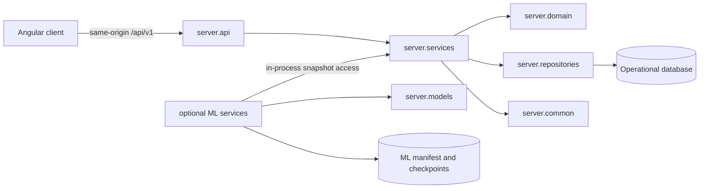

# Service boundaries

Last updated: 2026-09-16

## Ownership rules

- `server.common` and `server.domain` have no FastAPI, SQLAlchemy, or Alembic
  dependency.
- `server.repositories` owns SQLAlchemy models, repositories, and all database
  initialization; `server.migrations` owns the Alembic history.
- `server.models` and the ML-owned services own training execution and artifact
  persistence. They have no SQLAlchemy or Alembic dependency and do not own
  database migrations.
- The training worker consumes the repository-owned snapshot service through
  the shared in-process contract. Training input remains an immutable snapshot;
  ML verifies its content hash before use.
- The client receives capability and configuration documents from the service
  that owns them. It does not invent fitting or training defaults.

Import-boundary tests in `app/tests/backend` enforce these rules.
