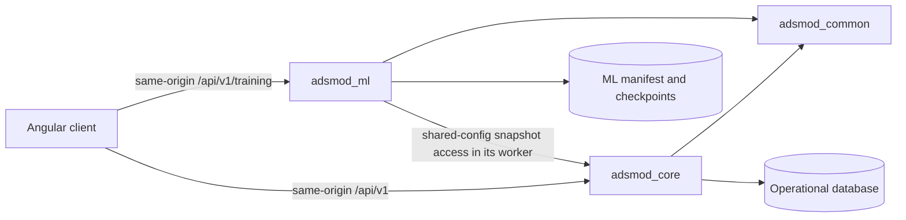

# Service boundaries

Last updated: 2026-08-30

## Ownership rules

- `adsmod_common` has no FastAPI, SQLAlchemy, or Alembic dependency.
- `adsmod_core` owns SQLAlchemy models, repositories, migrations, and all
  database initialization.
- `adsmod_ml` owns training execution and artifact persistence. Its source has
  no SQLAlchemy or Alembic dependency and does not own database migrations.
- The training worker opens the Core-owned snapshot service from the shared
  runtime configuration. Training input remains an immutable Core snapshot;
  ML verifies its content hash before use.
- The client receives capability and configuration documents from the service
  that owns them. It does not invent fitting or training defaults.

Import-boundary tests in `app/tests/backend` enforce these rules.
