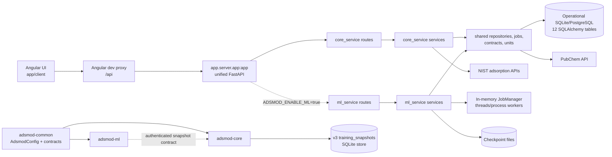

# ADSMOD System Overview

Last updated: 2026-08-20

## Current state

ADSMOD currently has one user-facing Angular application and two backend
generations:

- The active local-web runtime is the `app/server` workspace. Its unified
  entrypoint is `app.server.app:app`; it composes `core_service` routes and,
  when `ADSMOD_ENABLE_ML=true`, the `ml_service` routes.
- `core_service` owns health, dataset import, NIST, and fitting workflows.
- `ml_service` owns training dataset, checkpoint, and training lifecycle
  workflows. It currently uses shared repositories and the shared SQLAlchemy
  database, which is a documented transitional boundary.
- `shared` owns the operational SQLAlchemy schema, repositories, database
  sessions, job manager, common configuration projections, shared contracts,
  and canonical scientific unit conversion.
- The Angular UI in `app/client` is a single frontend. Its development proxy
  routes `/api/training/*` to the optional ML service and all other `/api/*`
  traffic to the core service.
- The extracted v3 packages under `app/backend` are implemented package
  boundaries, not the launcher-selected runtime yet. `adsmod-core` owns an
  authenticated immutable snapshot store; `adsmod-ml` owns the snapshot client
  and ML service boundary.

The active and v3 runtimes are intentionally documented separately. The v3
packages are not an alternate import path for the active services and do not
provide compatibility aliases. The launcher currently starts the active
`app/server` runtime; a future vertical-slice cutover must update every caller
and delete the replaced implementation in the same change.

## High-level runtime



The solid edges are current runtime dependencies. The dashed edge is the v3
internal contract already implemented by `adsmod-ml`; the v3 packages remain
separate from the active service workspace until the documented cutover.

## Repository layout

```text
app/
  client/                         Angular UI
  server/                         active/transitional backend workspace
    core_service/
      core_service/
        api/                       HTTP route modules
        configurations/             startup projections
        contracts/                  Pydantic transport/workflow contracts
        services/                   dataset, NIST, and fitting orchestration
    ml_service/
      ml_service/
        api/                       training HTTP route modules
        contracts/                  Pydantic transport/workflow contracts
        learning/                   model, serialization, and training code
        services/                   training orchestration
    shared/
      shared/
        common/                     canonical-config projections and utilities
        contracts/                  shared job response contracts
        repositories/               sessions, ORM schema, queries, repositories
        services/                   jobs, response construction, unit registry
    uv.lock                        single active-workspace lockfile
  backend/
    common/                        adsmod-common
    core/                           adsmod-core and snapshot persistence
    ml/                             adsmod-ml and snapshot client
  resources/
    adsmod.json                    only runtime value file
    adsmod.schema.json             generated from AdsmodConfig
```

## Entry points and source-of-truth rules

- Active core ASGI app: `core_service.app:app`.
- Active ML ASGI app: `ml_service.app:app`.
- Active unified composition: `app.server.app:app`.
- v3 core factory/CLI: `adsmod_core.create_app_from_path(...)` and the v3
  `--config` CLI option.
- v3 ML factory: `adsmod_ml.create_app(...)`.
- Runtime values: `app/resources/adsmod.json`, optionally under the explicit
  `ADSMOD_RESOURCES_DIR` resource root.
- Configuration shape: `adsmod_common.config.AdsmodConfig`.
- The v3 packages use `AdsmodConfig.storage` for their snapshot/storage path;
  the active service projection uses `AdsmodConfig.application.database` for
  its operational database. These are two fields in the one canonical model,
  not alternate files or validators.
- Transport/workflow types: service and shared `contracts` packages.
- Operational database model: `shared.repositories.schemas.models.Base.metadata`.
- v3 snapshot persistence: `adsmod_core.persistence.snapshots`.
- API descriptions: OpenAPI snapshots generated from running FastAPI apps.

No service-specific JSON files, old `domain` packages, `shared.models.jobs`,
unit-module re-exports, or configuration fallback accessors remain.

## Frontend responsibility

- `datasets` covers uploaded custom datasets and import validation/commit.
- `public-data` covers NIST adsorption experiments.
- `public-materials` covers NIST adsorbates/adsorbents and PubChem enrichment.
- `fitting` configures and runs scientific fits.
- `training` displays ML dataset, checkpoint, and run workflows and depends on
  the optional ML service at runtime.

The frontend behavior and public HTTP paths remain unchanged by the internal
consolidations in this review.
